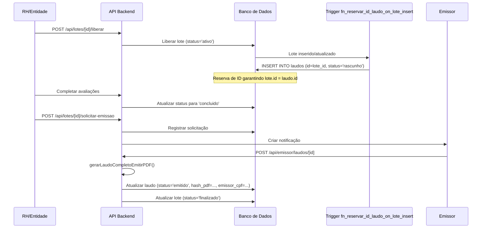

# QWork - Sistema de Avaliação de Saúde Ocupacional

## 📋 Visão Geral

Sistema para gestão de avaliações de saúde ocupacional, com foco em emissão manual de laudos médicos.

## 🔄 Fluxo Atual de Emissão de Laudos (100% Manual)

Após a remoção completa de auto-emissão (Migration 302), todos os laudos são emitidos manualmente pelo emissor autorizado.

### Sequência de Emissão



### Procedimentos Automatizados Mantidos

- **Reserva de ID**: Trigger `fn_reservar_id_laudo_on_lote_insert` cria laudo em 'rascunho' automaticamente
- **Mudança de Status**: Atualização automática para 'concluido' quando todas as avaliações são finalizadas
- **Constraint**: `lote.id = laudo.id` garantida pela reserva de ID

### Cron Jobs Desabilitados

- `/api/system/auto-laudo`: Desabilitado (status 410) - Emissão manual obrigatória
- `/api/jobs/process-pdf`: Migrado para emissor local - Não mais usado em produção

## 🧪 Testes

Execute testes específicos para validação:

```bash
# Testes de fluxo manual
pnpm test -- --testNamePattern="manual-emission-flow"

# Validação de endpoints desabilitados
pnpm test -- --testNamePattern="disabled-cron-endpoints"

# Reserva de ID automática
pnpm test -- --testNamePattern="id-reservation-trigger"
```

## 🚀 Deploy

1. Backup da base de produção
2. Executar migration 302
3. Validar remoções
4. Deploy do código
5. Monitorar logs por 48h

## 📚 Documentação Adicional

- [Migrations Legadas](database/migrations/MIGRATIONS-AUTO-EMISSAO-LEGADAS.md)
- [Testes a Remover](__tests__/TESTES-AUTO-EMISSAO-REMOVER.md)
- [Estrutura do Projeto](__tests__/STRUCTURE.md)
