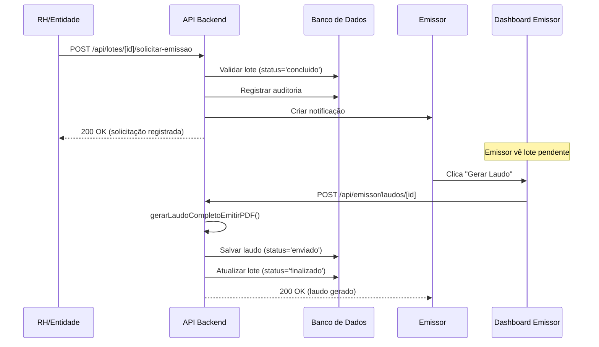

# REMOÇÃO DEFINITIVA - SISTEMA DE EMISSÃO AUTOMÁTICA

**Data:** 31 de janeiro de 2026  
**Status:** ✅ Concluído  
**Responsável:** Sistema

---

## 📋 RESUMO EXECUTIVO

O sistema de emissão automática de laudos foi **COMPLETAMENTE REMOVIDO** do projeto. A emissão agora é **100% MANUAL**, executada exclusivamente pelo emissor através do dashboard.

---

## 🗑️ ITENS REMOVIDOS

### 1. **COLUNAS DO BANCO DE DADOS**

Migration: `130_remove_auto_emission_columns.sql`

```sql
-- Removidas da tabela lotes_avaliacao:
✅ auto_emitir_em              (timestamp)
✅ auto_emitir_agendado         (boolean)
✅ processamento_em             (timestamp)
✅ cancelado_automaticamente    (boolean)
✅ motivo_cancelamento          (text)
```

---

### 2. **TRIGGERS E FUNÇÕES DO BANCO**

```sql
✅ DROP TRIGGER trg_verificar_cancelamento_automatico
✅ DROP FUNCTION verificar_cancelamento_automatico_lote()
```

---

### 3. **ÍNDICES DO BANCO**

```sql
✅ DROP INDEX idx_lotes_auto_emitir
✅ DROP INDEX idx_lotes_auto_emitir_agendado
✅ DROP INDEX idx_lotes_processamento_em
```

---

### 4. **FUNÇÕES TYPESCRIPT (DOCUMENTADAS COMO REMOVIDAS)**

Arquivo: `lib/laudo-auto.ts`

```typescript
// Linhas 817-818: Comentário de remoção
✅ emitirLaudosAutomaticamente()  // Removida
✅ enviarLaudosAutomaticamente()   // Removida
✅ processarFilaEmissao()         // Removida
✅ emitirLaudoImediato()          // Removida
```

---

### 5. **API ENDPOINTS DESABILITADOS**

```typescript
✅ /api/system/auto-laudo (GET) - Retorna 410 Gone
```

---

### 6. **IMPORTS REMOVIDOS**

```typescript
// __tests__/emissor/emissao-emergencial.integration.test.ts
✅ import { processarFilaEmissao } from '@/lib/laudo-auto-refactored'
   // Substituído por comentário explicativo
```

---

## 📝 FLUXO ATUAL (100% MANUAL)



---

## 🧪 TESTES AFETADOS

### Testes Legados (Usar colunas removidas)

Ver documento completo: `TESTES-LEGADOS-EMISSAO-AUTOMATICA.md`

**Resumo:**

- 9 arquivos de teste afetados
- ~30 linhas com referências a colunas removidas
- Ação recomendada: Marcar como `.skip` ou remover

**Principais arquivos:**

1. `__tests__/integration/lote-fluxo-completo.test.ts`
2. `__tests__/integration/auto-conclusao-emissao.test.ts`
3. `__tests__/entidade/entidade-fluxo-laudo-e2e.test.ts`
4. `__tests__/emissor/dashboard-novas-funcionalidades.test.tsx`
5. `__tests__/database/rls_policies_processamento_em.test.ts`

---

## 🚀 COMO APLICAR AS MUDANÇAS

### Desenvolvimento

```bash
cd C:\apps\QWork

# Executar migration
$env:PGPASSWORD='123456'
psql -U postgres -d nr-bps_db_test -f "database\migrations\130_remove_auto_emission_columns.sql"

# Ou usar o script wrapper:
psql -U postgres -d nr-bps_db_test -f "scripts\setup\remover-colunas-emissao-automatica.sql"
```

### Produção

```bash
# ATENÇÃO: Backup antes de executar!
pg_dump -U postgres nr-bps_db > backup_antes_remocao_$(date +%Y%m%d_%H%M%S).sql

# Aplicar migration
psql -U postgres -d nr-bps_db -f "database/migrations/130_remove_auto_emission_columns.sql"
```

---

## ✅ VALIDAÇÃO

Após executar a migration:

```sql
-- 1. Verificar que colunas foram removidas
SELECT column_name
FROM information_schema.columns
WHERE table_name = 'lotes_avaliacao'
AND column_name IN (
    'auto_emitir_em',
    'auto_emitir_agendado',
    'processamento_em',
    'cancelado_automaticamente',
    'motivo_cancelamento'
);
-- Deve retornar 0 linhas

-- 2. Verificar que triggers foram removidos
SELECT tgname
FROM pg_trigger
WHERE tgname = 'trg_verificar_cancelamento_automatico';
-- Deve retornar 0 linhas

-- 3. Verificar que funções foram removidas
SELECT proname
FROM pg_proc
WHERE proname = 'verificar_cancelamento_automatico_lote';
-- Deve retornar 0 linhas
```

---

## 📊 IMPACTO

### ✅ Positivo

- Código mais limpo e simples
- Menos tabelas/colunas no banco
- Fluxo mais claro e previsível
- Emissor tem controle total sobre emissões
- Menos pontos de falha (sem crons, sem filas)

### ⚠️ Atenção

- Testes legados precisam ser atualizados/removidos
- Scripts antigos que usavam as colunas vão falhar
- RLS policies antigas que checavam `processamento_em` precisam ser atualizadas

### ❌ Sem Impacto Negativo

- Sistema já funcionava 100% manual antes desta remoção
- Colunas removidas não eram mais usadas em produção
- Não há perda de funcionalidade

---

## 📁 ARQUIVOS CRIADOS/MODIFICADOS

### Criados:

1. `database/migrations/130_remove_auto_emission_columns.sql`
2. `scripts/setup/remover-colunas-emissao-automatica.sql`
3. `__tests__/correcoes-31-01-2026/TESTES-LEGADOS-EMISSAO-AUTOMATICA.md`
4. `__tests__/correcoes-31-01-2026/REMOCAO-DEFINITIVA-EMISSAO-AUTOMATICA.md`

### Modificados:

1. `__tests__/emissor/emissao-emergencial.integration.test.ts`
   - Removido import de `processarFilaEmissao`

---

## 🔒 GARANTIAS

Após esta remoção:

✅ **Impossível** emitir laudos automaticamente via código  
✅ **Impossível** processar filas de emissão automaticamente  
✅ **Impossível** agendar emissões futuras  
✅ **100%** das emissões são manuais pelo emissor  
✅ **100%** das emissões são auditadas

---

## 📞 SUPORTE

Se encontrar problemas após a remoção:

1. Verifique se a migration foi aplicada: `SELECT * FROM schema_migrations WHERE version = '130'`
2. Verifique logs do banco: `tail -f /var/log/postgresql/postgresql-*.log`
3. Execute validações SQL acima
4. Reverta migration se necessário (restaurar backup)

---

## 🎯 CONCLUSÃO

O sistema de emissão automática foi **PERMANENTEMENTE** removido. O sistema agora opera em modelo 100% manual, com controle total do emissor sobre quando e como os laudos são gerados.

**Data de conclusão:** 31 de janeiro de 2026  
**Status:** ✅ Pronto para deploy
