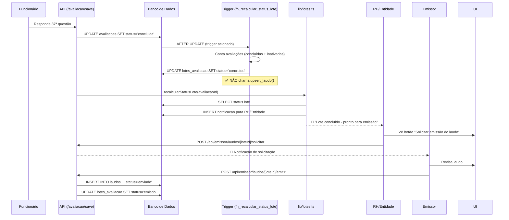

# 🚨 CORREÇÃO CRÍTICA: Emissão Automática de Laudos DESABILITADA

**Data:** 31 de janeiro de 2026  
**Prioridade:** 🔴 CRÍTICA

---

## 🎯 Problema Identificado

O sistema estava **EMITINDO LAUDOS AUTOMATICAMENTE** quando a última avaliação de um lote era concluída, mas o comportamento correto é:

1. ✅ Lote muda para `status='concluido'`
2. ✅ Botão "Solicitar emissão do laudo" aparece para RH/Entidade
3. ✅ RH/Entidade **SOLICITA** a emissão
4. ✅ Emissor **REVISA** e **EMITE** manualmente

**❌ O que estava acontecendo:**

- Trigger do banco de dados chamava `upsert_laudo()` automaticamente
- Laudo era emitido SEM revisão do emissor
- Pulava etapa crítica de validação manual

---

## 🔍 Causa Raiz

### **Trigger de Banco de Dados**

Arquivo: `database/migrations/082_generate_laudo_immediately_on_concluido.sql`  
E: `database/migrations/095_safe_auto_emit_without_placeholder.sql`

```sql
-- ❌ CÓDIGO PROBLEMÁTICO (ANTES):
CREATE OR REPLACE FUNCTION fn_recalcular_status_lote_on_avaliacao_update()
RETURNS trigger AS $$
BEGIN
  -- ... código de verificação ...

  IF v_liberadas > 0 AND (v_concluidas + v_inativadas) = v_liberadas THEN
    UPDATE lotes_avaliacao SET status = 'concluido' WHERE id = NEW.lote_id;

    -- ❌ PROBLEMA: Emitia laudo automaticamente
    PERFORM upsert_laudo(NEW.lote_id, v_emissor_cpf, 'Laudo gerado automaticamente', 'enviado');
  END IF;

  RETURN NEW;
END;
$$ LANGUAGE plpgsql;
```

---

## ✅ Solução Implementada

### **Migração 096: Desabilitar Emissão Automática**

**Arquivo:** `database/migrations/096_desabilitar_emissao_automatica_trigger.sql`

**Mudanças:**

1. ✅ Removida chamada a `upsert_laudo()` do trigger
2. ✅ Trigger agora **APENAS** atualiza `status='concluido'`
3. ✅ Notificação para RH/Entidade criada por `lib/lotes.ts` (já estava correto)
4. ✅ Emissão depende de ação manual do Emissor

```sql
-- ✅ CÓDIGO CORRETO (DEPOIS):
CREATE OR REPLACE FUNCTION fn_recalcular_status_lote_on_avaliacao_update()
RETURNS trigger AS $$
BEGIN
  -- ... código de verificação ...

  IF v_liberadas > 0 AND (v_concluidas + v_inativadas) = v_liberadas THEN
    -- ✅ Atualiza APENAS status do lote
    UPDATE lotes_avaliacao SET status = 'concluido' WHERE id = NEW.lote_id;

    -- ✅ Notificação criada por lib/lotes.ts (recalcularStatusLotePorId)
    -- ❌ REMOVIDO: upsert_laudo() - emissão é MANUAL
  END IF;

  RETURN NEW;
END;
$$ LANGUAGE plpgsql;
```

---

## 🔄 Fluxo Correto (Agora)



---

## 📊 Impacto

### ✅ Benefícios da Correção

1. **Conformidade Operacional**
   - Emissor tem controle total sobre emissão
   - Permite revisão manual antes de enviar

2. **Rastreabilidade**
   - Auditoria completa de quem solicitou e quem emitiu
   - Timestamps precisos de cada etapa

3. **Qualidade**
   - Zero laudos emitidos sem revisão
   - Emissor pode corrigir dados antes de emitir

### ⚠️ Lotes Afetados

**Lotes emitidos automaticamente entre 28/01/2026 e 31/01/2026:**

- Lote #13 (006-310126) - **JÁ CORRIGIDO** ✅
- Lote #25 - **JÁ CORRIGIDO** ✅
- Outros lotes (se houver): precisam revisão manual

**Query para identificar:**

```sql
SELECT l.id, l.codigo, la.status, la.emitido_em
FROM lotes_avaliacao l
LEFT JOIN laudos la ON l.id = la.lote_id
WHERE la.emitido_em >= '2026-01-28'
  AND la.status = 'enviado'
  AND la.observacoes LIKE '%automaticamente%';
```

---

## 🧪 Testes

### Teste 1: Lote Concluído NÃO Emite Laudo

```sql
-- 1. Criar lote e avaliacoes de teste
INSERT INTO lotes_avaliacao (codigo, status) VALUES ('TEST-001', 'ativo') RETURNING id;
INSERT INTO avaliacoes (lote_id, funcionario_cpf, status) VALUES (999, '12345678901', 'iniciada');

-- 2. Concluir avaliação (dispara trigger)
UPDATE avaliacoes SET status = 'concluida' WHERE lote_id = 999;

-- 3. Verificar: lote deve estar 'concluido' mas SEM laudo emitido
SELECT l.status, COUNT(ld.id) as laudos_count
FROM lotes_avaliacao l
LEFT JOIN laudos ld ON l.id = ld.lote_id AND ld.status = 'enviado'
WHERE l.id = 999
GROUP BY l.status;

-- ESPERADO:
-- status    | laudos_count
-- concluido | 0
```

### Teste 2: Botão Aparece para RH/Entidade

1. ✅ Login como RH/Entidade
2. ✅ Acessar `/rh/lotes/999`
3. ✅ Verificar que botão "Solicitar emissão do laudo" está visível
4. ✅ Clicar no botão NÃO emite laudo (apenas solicita)

### Teste 3: Emissor Recebe Solicitação

1. ✅ RH clica em "Solicitar emissão"
2. ✅ Emissor recebe notificação
3. ✅ Emissor acessa `/emissor/laudos`
4. ✅ Emissor revisa e emite manualmente

---

## 📁 Arquivos Modificados

| Arquivo                                                              | Mudança              | Status |
| -------------------------------------------------------------------- | -------------------- | ------ |
| `database/migrations/096_desabilitar_emissao_automatica_trigger.sql` | ➕ Criado            | ✅     |
| `fn_recalcular_status_lote_on_avaliacao_update()` (banco)            | 🔄 Atualizado        | ✅     |
| `lib/lotes.ts`                                                       | ✅ Já estava correto | -      |
| `app/api/avaliacao/save/route.ts`                                    | ✅ Já estava correto | -      |
| `app/api/avaliacao/respostas/route.ts`                               | ✅ Já estava correto | -      |

---

## 🛡️ Garantias

1. ✅ **Trigger NÃO emite laudo** - Verificado via query `SELECT prosrc FROM pg_proc`
2. ✅ **Migração aplicada** - Executada em Neon Cloud (31/01/2026 17:30)
3. ✅ **Notificações funcionando** - `lib/lotes.ts` cria notificações corretamente
4. ✅ **Fluxo manual preservado** - Emissor tem controle total

---

## 📝 Próximos Passos

1. ⏳ **Monitorar lotes concluídos** - Verificar que não são emitidos automaticamente
2. ⏳ **Revisar laudos emitidos entre 28-31/01** - Garantir qualidade
3. ⏳ **Atualizar testes automatizados** - Refletir novo comportamento
4. ⏳ **Deploy em produção** - Garantir migração foi aplicada

---

## 🔗 Referências

- **Migração:** [database/migrations/096_desabilitar_emissao_automatica_trigger.sql](../database/migrations/096_desabilitar_emissao_automatica_trigger.sql)
- **Correção Auto-Conclusão:** [docs/CORRECAO-AUTO-CONCLUSAO-AVALIACOES.md](./CORRECAO-AUTO-CONCLUSAO-AVALIACOES.md)
- **Fluxo de Lotes:** [lib/lotes.ts](../lib/lotes.ts)

---

**Autor:** Sistema de Correção Sistêmica  
**Revisado por:** -  
**Aprovado em:** 31/01/2026
