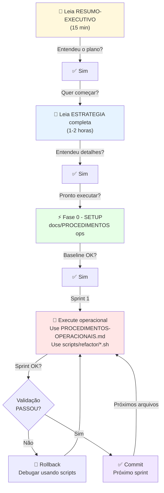

# 📚 ÍNDICE DE DOCUMENTAÇÃO - Refatoração Incremental QWork

**Criado**: 7 de fevereiro de 2026  
**Status**: ✅ Documentação Completa

---

## 🗺️ MAPA DE DOCUMENTAÇÃO

### 1️⃣ **COMECE AQUI** (15 minutos)

📄 [RESUMO-EXECUTIVO-REFATORACAO.md](RESUMO-EXECUTIVO-REFATORACAO.md)

- Visão geral da estratégia
- Problemas e soluções
- Roadmap completo
- Por que essa abordagem funciona
- **Para**: Entender o plano em 15 minutos

---

### 2️⃣ **ENTENDA A ESTRATÉGIA** (1-2 horas)

📄 [ESTRATEGIA-REFATORACAO-INCREMENTAL.md](ESTRATEGIA-REFATORACAO-INCREMENTAL.md)

**Seções**:

- 📌 Problema crítico (por que não fazer tudo de uma vez)
- 📊 Matriz de arquivos a refatorar (tamanhos, prioridades)
- 📋 Fases de refatoração (7 fases estruturadas)
- 🔬 Análise detalhada por arquivo (cada arquivo tem seção)
- 🎯 Padrões de refatoração (3 padrões principais)
- 🔄 Processo universal por sprint (checklist)
- ✅ Critérios de sucesso (por arquivo e global)
- 📦 Estrutura de sprints proposta (12+ sprints)

**Para**: Entender em detalhes como refatorar cada arquivo

---

### 3️⃣ **EXECUTE OPERACIONALMENTE** (Usar durante sprints)

📄 [PROCEDIMENTOS-OPERACIONAIS.md](PROCEDIMENTOS-OPERACIONAIS.md)

**Seções**:

- 🔧 PRÉ-REQUISITOS (ferramentas, checks)
- 📊 FASE 0: Baseline & Setup (cria branch, testes baseline)
- 📋 FASE 1: Análise Detalhada (mapeia dependências)
- 🏗️ FASE 2: Preparação de Estrutura (cria pastas, INDEX files)
- 🔄 FASE 3: Migração (template repetível por sprint)
- 🧪 Validação por Sprint (checklist universal)
- 🚨 Rollback Procedure (se algo falhar)
- 📊 Métricas de Progresso (tracking automático)
- 📝 Template de Commit (convenção)

**Para**: Passo-a-passo durante cada sprint

**Uso**: Ter este documento aberto enquanto executa

---

### 4️⃣ **USE FERRAMENTAS AUTOMÁTICAS** (Durante execução)

📄 [FERRAMENTAS-REFATORACAO.md](FERRAMENTAS-REFATORACAO.md)

**Scripts Inclusos**:

1. `analyze-dependencies.sh` - Mapeia quem usa cada função
2. `check-file-size.sh` - Monitora redução de linhas
3. `validate-refactor.sh` - Suite completa pós-sprint
4. `find-importers.sh` - Busca inteligente de importers
5. `compare-refactor.sh` - Análise antes/depois
6. `create-stub.sh` - Cria arquivos stub
7. `status.sh` - Status geral

**Para**: Automatizar análises e validações

**Uso**: Execute scripts quando necessário análise/validação

---

## 🎯 FLUXO DE USO



---

## 📋 CHECKLIST DE PREPARAÇÃO

Antes de começar QUALQUER sprint:

- [ ] Clonar/atualizar repositório
- [ ] Ler `RESUMO-EXECUTIVO-REFATORACAO.md` (15 min)
- [ ] Ler `ESTRATEGIA-REFATORACAO-INCREMENTAL.md` (1-2 hrs)
- [ ] Entender o padrão relevante (3 padrões existem)
- [ ] Executar FASE 0 de `PROCEDIMENTOS-OPERACIONAIS.md`
  - [ ] Criar branch
  - [ ] Executar baseline (testes, build)
  - [ ] Documentar baseline
- [ ] Executar FASE 1
  - [ ] Análise de dependências
  - [ ] Mapeamento de usuários
  - [ ] Diagrama de estrutura
- [ ] AGORA SIM: Pronto para primeiro sprint

---

## 🎓 PADRÕES DE REFATORAÇÃO

Todos explicados em `ESTRATEGIA-REFATORACAO-INCREMENTAL.md`:

### Padrão 1: INDEX File (Compatibilidade)

```typescript
// lib/db.ts (NOVO - 80 linhas)
export { query } from './infrastructure/database/queries';
export type { QueryResult } from './infrastructure/database/types';
// Re-exports mantêm imports antigos 100% compatíveis
```

**Quando usar**: Dividir grande arquivo em módulos pequenos

---

### Padrão 2: Custom Hooks (Componentes)

```typescript
// lib/hooks/useNovoscadastros.ts (150 linhas)
export function useNovoscadastros() {
  const [cadastros, setCadastros] = useState([]);
  // Lógica de dados aqui
  return { cadastros, loading, filtros };
}

// components/novos-cadastros/index.tsx (100 linhas)
export function NovoscadastrosContent() {
  const { cadastros, loading } = useNovoscadastros();
  return <div>/* UI simples */</div>;
}
```

**Quando usar**: Separar lógica de dados da UI no React

---

### Padrão 3: Composição (UI)

```typescript
// components/lote-details/index.tsx (150 linhas)
export function LoteDetailsPage() {
  return (
    <div>
      <LoteHeader />
      <LoteTabs />
      <LoteFuncionarios />
    </div>
  );
}
```

**Quando usar**: Quebrar componentes gigantes em sub-componentes

---

## 📊 ESTRUTURA DE SPRINTS

Cada sprint segue este template (em PROCEDIMENTOS-OPERACIONAIS.md):

```
Sprint N: [NOME DO ARQUIVO/MÓDULO]
├─ PRÉ-SPRINT (setup sub-branch, documentar)
├─ DURANTE (mover código, atualizar imports)
├─ PÓS-SPRINT (validar com scripts)
└─ COMMIT (merge + documentar)

⏱️  Duração: 3-4 horas idealmente
📦 Tamanho: 1 arquivo ou módulo pequeno (max ~400 linhas novas)
✅ Validação: Testes + Build + Lint
```

---

## 🚀 ROADMAP EXECUTIVO

### Semana 1: Setup

- [ ] Ler documentação (esta)
- [ ] Executar FASE 0 (baseline)
- [ ] Executar FASE 1 (análise)
- [ ] Preparar FASE 2 (estrutura)
- **Resultado**: Repo pronto, análise completa

### Semanas 2-4: Backend (lib/db.ts)

- [ ] Sprint 1: Types
- [ ] Sprint 2: Connection
- [ ] Sprint 3: Queries
- [ ] Sprint 4: Transactions
- [ ] Sprint 5-6: Repositories (entidade, financial, notifications)
- **Resultado**: lib/db.ts modularizado completamente

### Semanas 5-6: Backend (laudo-auto.ts)

- [ ] Sprint 7-9: Laudo services decomposição
- **Resultado**: Lógica de laudo modularizada

### Semanas 7-10: Componentes RH

- [ ] Sprint 10-17: `app/rh/empresa/[id]/lote/[loteId]/page.tsx`
- **Resultado**: Página decomposta em componentes

### Semanas 11-14: Admin & Conta

- [ ] Sprint 18-28: NovoscadastrosContent, ClinicasContent, ContaSection
- **Resultado**: Components refatorados

### Semanas 15-16: Cleanup & Teste

- [ ] Sprint 29-30: Páginas restantes
- [ ] Validação final COMPLETA
- **Resultado**: Tudo refatorado, testes passam, build OK

---

## 📈 KPIs (Key Performance Indicators)

Meça sucesso com:

| KPI                | Baseline | Target | Sprint   |
| ------------------ | -------- | ------ | -------- |
| Max linhas/arquivo | 1865     | <500   | Contínuo |
| Avg linhas/arquivo | ~850     | <300   | Contínuo |
| Arquivos gigantes  | 10       | 0      | Final    |
| Tempo build        | ~45s     | <35s   | Final    |
| Tests passing      | ~95%     | 100%   | Contínuo |
| Lint warnings      | <50      | 0      | Contínuo |

---

## 🔗 REFERÊNCIAS INTERNAS

Documentação relacionada no seu projeto:

- `docs/architecture/refactor-plan.md` - Plano anterior (parcialmente implementado)
- `docs/DESENVOLVIMENTO_GUIDE.md` - Estrutura existente
- `__tests__/STRUCTURE.md` - Testes já organizados

---

## 💡 DICAS IMPORTANTES

### ✅ Faça

- ✅ Ler documentação antes de cada sprint
- ✅ Executar validação após cada sprint
- ✅ Documento cada mudança (Comments)
- ✅ Commit após cada sprint convergente
- ✅ Rastrear tempo gasto
- ✅ Pedir ajuda se travar

### ❌ Não faça

- ❌ Tentar refatorar 2 arquivos num sprint
- ❌ Pular validação (testes/build)
- ❌ Fazer mudanças funcionais junto
- ❌ Ignorar erros de type-check
- ❌ Refatorar imports sem testar
- ❌ Fazer tudo de uma vez (motivo desta estratégia!)

---

## ❓ FAQ

### P: Por quanto tempo isso vai levar?

**R**: 2-4 meses com dedidação total.  
Se 1 sprint por dia = 30 sprints ÷ 5 dias/semana = 6 semanas  
Mais realista: 10-16 semanas (sprints mais complexos depois)

### P: Pessoas vão conseguir desenvolver enquanto refatoramos?

**R**: **SIM**! Refatoração é em branch separada. Main branch continua operacional.

### P: E se quebrarem imports?

**R**: INDEX files mantêm compatibilidade 100%. Imports antigos continuam funcionando.

### P: Como saber se funcionou?

**R**: Testes + Build validam automaticamente após cada sprint.

### P: Preciso de múltiplas pessoas?

**R**: Não necessário. 1 pessoa bem tempo-dedicada consegue.  
Múltiplas pessoas pode ser mais rápido (sprints paralelos em arquivos diferentes).

### P: E se encontrar um bug durante refatoração?

**R**: Documentar em issue, mas NÃO corrigir durante refatoração.  
Refatoração é 100% reorganização, zero mudanças funcionais.

---

## 📞 SUPORTE

Se travar ou não saber próximo passo:

1. ✅ Verificar em qual FASE está (0-3)
2. ✅ Abrir documento relevante (uma das 4 principais)
3. ✅ Procurar seção correspondente
4. ✅ Se ainda em dúvida: executar script correspondente
5. ✅ Se ainda não resolveu: rollback (descrito em PROCEDIMENTOS-OPERACIONAIS.md)

---

## ✨ SUCESSO!

Após completar esta refatoração, seu projeto terá:

```
🎯 Arquivos menores e mais focados
🎯 Componentes reutilizáveis
🎯 Testes mais simples
🎯 Build mais rápido
🎯 Manutenção facilitada
🎯 Documentação atualizada
🎯 Zero regressões funcionais
```

---

**Criado por**: GitHub Copilot  
**Data**: 7 de fevereiro de 2026  
**Versão da Documentação**: 1.0

**Status**: ✅ PRONTO PARA EXECUÇÃO

---

## 📖 Ordem de Leitura RECOMENDADA

```
1. Este arquivo (índice) - 5 min
   ↓
2. RESUMO-EXECUTIVO-REFATORACAO.md - 15 min
   ↓
3. ESTRATEGIA-REFATORACAO-INCREMENTAL.md - 1-2 horas
   ↓
4. PROCEDIMENTOS-OPERACIONAIS.md (seção FASE 0) - 2 horas
   ↓
5. Execute FASE 0 (setup + baseline)
   ↓
6. Volte para PROCEDIMENTOS-OPERACIONAIS.md (seção FASE 1)
   ↓
7. Execute FASE 1 (análise)
   ↓
8. Consulte FERRAMENTAS-REFATORACAO.md quando precisar scripts
   ↓
9. Execute FASE 3 (sprints)
   ↓
10. Repita sprint N até completar
```

**Tempo total de preparação**: ~4-5 horas  
**Depois**: 3-4 horas por sprint

---

**COMECE**: Abra `RESUMO-EXECUTIVO-REFATORACAO.md` AGORA!
