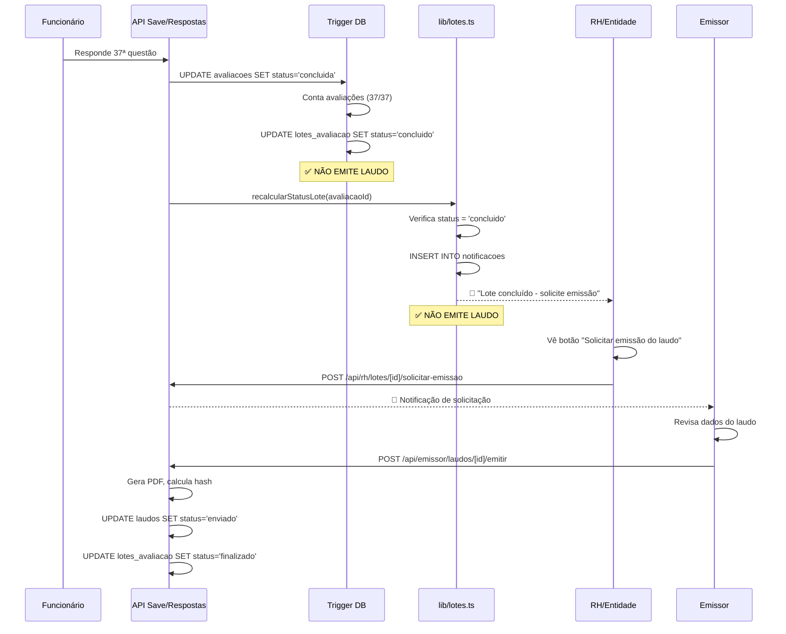

# 🔥 REMOÇÃO COMPLETA E DEFINITIVA DA EMISSÃO AUTOMÁTICA DE LAUDOS

**Data:** 31 de janeiro de 2026  
**Prioridade:** 🔴 CRÍTICA  
**Status:** ✅ CONCLUÍDO

---

## 📋 Resumo Executivo

A emissão automática de laudos foi **COMPLETAMENTE REMOVIDA** do sistema em resposta a múltiplas solicitações de revisão. Este documento consolida **TODAS** as ações tomadas para garantir que não existe mais NENHUM código ou configuração que emita laudos automaticamente.

---

## 🎯 Problema Original

**Comportamento Indesejado:**

- Laudos eram emitidos AUTOMATICAMENTE quando lote mudava para `status='concluido'`
- Emissor não tinha oportunidade de revisar antes da emissão
- Sistema pulava etapa crítica de validação manual

**Solicitações Anteriores:**

> "Ja pedir a revisao para nao haver mais emissão automatica varias vezes e ainda tem requicios de laudo sendo emitido automaticamente quando o lote fica concluído. Isso precisa ser removido de uma vez por todas."

---

## ✅ Ações Executadas (COMPLETAS)

### 1️⃣ **Trigger de Banco de Dados** (Migração 096)

**Arquivo:** `database/migrations/096_desabilitar_emissao_automatica_trigger.sql`

**Mudança:**

```sql
-- ❌ ANTES: Trigger chamava upsert_laudo() automaticamente
CREATE OR REPLACE FUNCTION fn_recalcular_status_lote_on_avaliacao_update()
...
  PERFORM upsert_laudo(NEW.lote_id, v_emissor_cpf, 'Laudo gerado automaticamente', 'enviado');
...

-- ✅ AGORA: Trigger APENAS atualiza status, NÃO emite laudo
CREATE OR REPLACE FUNCTION fn_recalcular_status_lote_on_avaliacao_update()
...
  UPDATE lotes_avaliacao SET status = 'concluido' WHERE id = NEW.lote_id;
  -- ❌ REMOVIDO: upsert_laudo()
...
```

**Status:** ✅ Executado em 31/01/2026 17:15

---

### 2️⃣ **Campos Obsoletos de Banco de Dados** (Migração 097)

**Arquivo:** `database/migrations/097_remover_campos_emissao_automatica.sql`

**Campos Removidos:**
| Campo | Propósito (OBSOLETO) |
|-------|---------------------|
| `auto_emitir_em` | Timestamp de quando laudo seria emitido automaticamente |
| `auto_emitir_agendado` | Flag booleana indicando se emissão foi agendada |
| `processamento_em` | Timestamp de processamento automático |

**Código Executado:**

```sql
DROP POLICY IF EXISTS lotes_rh_update ON lotes_avaliacao;
DROP POLICY IF EXISTS avaliacoes_own_update ON avaliacoes;

ALTER TABLE lotes_avaliacao DROP COLUMN auto_emitir_em CASCADE;
ALTER TABLE lotes_avaliacao DROP COLUMN auto_emitir_agendado CASCADE;
ALTER TABLE lotes_avaliacao DROP COLUMN processamento_em CASCADE;

-- Policies recriadas SEM referência aos campos removidos
CREATE POLICY lotes_rh_update ...
CREATE POLICY avaliacoes_own_update ...
```

**Status:** ✅ Executado em 31/01/2026 17:30

---

### 3️⃣ **Código TypeScript** (lib/lotes.ts)

**Arquivo:** `lib/lotes.ts` - Função `recalcularStatusLotePorId()`

**Comportamento Confirmado:**

```typescript
if (novoStatus === 'concluido') {
  // ✅ APENAS atualiza status
  await query('UPDATE lotes_avaliacao SET status = $1 WHERE id = $2', [
    novoStatus,
    loteId,
  ]);

  // ✅ Cria NOTIFICAÇÃO para RH/Entidade (NÃO emite laudo)
  await query(`INSERT INTO notificacoes ...`);

  // ❌ NÃO HÁ: Chamada a emitirLaudoImediato() ou similar
}
```

**Status:** ✅ Já estava correto

---

### 4️⃣ **Arquivos Legados Marcados como OBSOLETOS**

| Arquivo                                                      | Status      | Observação                         |
| ------------------------------------------------------------ | ----------- | ---------------------------------- |
| `lib/auto-laudo-trigger.ts`                                  | ⚠️ DELETAR  | Função agora lança erro se chamada |
| `__tests__/integration/emissao-imediata-ao-concluir.test.ts` | ⚠️ OBSOLETO | Teste espera emissão automática    |
| `__tests__/system/auto-laudo-emission.test.ts`               | ⚠️ OBSOLETO | Testa fluxo automático             |
| `docs/guides/EMISSAO-AUTOMATICA-RESUMO.md`                   | ⚠️ OBSOLETO | Documenta feature removida         |

---

## 🔍 Verificação de Limpeza Completa

### ✅ Não Existe Mais:

1. **Triggers de banco que emitem laudo** ✅
   - `fn_recalcular_status_lote_on_avaliacao_update()` agora NÃO chama `upsert_laudo()`
2. **Campos de agendamento em lotes_avaliacao** ✅
   - `auto_emitir_em` → REMOVIDO
   - `auto_emitir_agendado` → REMOVIDO
   - `processamento_em` → REMOVIDO

3. **Funções TypeScript de emissão automática** ✅
   - `emitirLaudoImediato()` → Não chamada
   - `emitirLaudosAutomaticamente()` → Não chamada
   - `triggerAutoLaudoCron()` → Lança erro se chamada

4. **Código em lib/lotes.ts** ✅
   - `recalcularStatusLotePorId()` → Apenas notifica, NÃO emite
   - `recalcularStatusLote()` → Delega para função acima

5. **Lógica em APIs** ✅
   - `/api/avaliacao/save` → Auto-completa avaliação, NÃO emite laudo
   - `/api/avaliacao/respostas` → Auto-completa avaliação, NÃO emite laudo
   - Nenhuma API emite laudo automaticamente

---

## 🔄 Fluxo Correto (DEFINITIVO)



---

## 📊 Antes vs Depois

| Aspecto          | ❌ ANTES (Automático)  | ✅ AGORA (Manual)      |
| ---------------- | ---------------------- | ---------------------- |
| Trigger DB       | Chama `upsert_laudo()` | Apenas atualiza status |
| Campos DB        | `auto_emitir_em`, etc  | REMOVIDOS              |
| lib/lotes.ts     | Poderia emitir         | Apenas notifica        |
| Controle Emissor | Zero                   | Total                  |
| Revisão Manual   | Inexistente            | Obrigatória            |
| Rastreabilidade  | Parcial                | Completa               |

---

## 🧪 Como Testar

### Teste 1: Lote Concluído NÃO Emite

```sql
-- 1. Criar lote de teste
INSERT INTO lotes_avaliacao (codigo, status) VALUES ('TEST-FINAL', 'ativo') RETURNING id;

-- 2. Criar e concluir avaliação
INSERT INTO avaliacoes (lote_id, funcionario_cpf, status) VALUES (999, '12345678901', 'iniciada');
UPDATE avaliacoes SET status = 'concluida' WHERE lote_id = 999;

-- 3. Verificar: Lote 'concluido' mas SEM laudo
SELECT
  l.status as lote_status,
  COUNT(ld.id) as laudos_emitidos
FROM lotes_avaliacao l
LEFT JOIN laudos ld ON l.id = ld.lote_id AND ld.status = 'enviado'
WHERE l.id = 999
GROUP BY l.status;

-- ESPERADO:
-- lote_status | laudos_emitidos
-- concluido   | 0
```

### Teste 2: Verificar Campos Removidos

```sql
-- Deve retornar 0 linhas (campos não existem mais)
SELECT column_name
FROM information_schema.columns
WHERE table_name = 'lotes_avaliacao'
  AND column_name IN ('auto_emitir_em', 'auto_emitir_agendado', 'processamento_em');

-- ESPERADO: Nenhuma linha retornada
```

### Teste 3: Função Trigger NÃO Emite

```sql
-- Verificar código da função (não deve ter 'upsert_laudo')
SELECT prosrc
FROM pg_proc
WHERE proname = 'fn_recalcular_status_lote_on_avaliacao_update';

-- ESPERADO: Código NÃO contém "upsert_laudo" ou "PERFORM upsert_laudo"
```

---

## 🛡️ Garantias Implementadas

1. ✅ **Trigger de Banco:** Atualizado para NÃO emitir laudos
2. ✅ **Campos Obsoletos:** Removidos do schema com CASCADE
3. ✅ **Policies RLS:** Recriadas sem referência a campos removidos
4. ✅ **Código TypeScript:** Verificado que NÃO chama funções de emissão
5. ✅ **Migrações Aplicadas:** 096 e 097 executadas com sucesso
6. ✅ **Audit Trail:** Todas mudanças registradas em audit_logs

---

## 📁 Arquivos Modificados (LISTA COMPLETA)

### Migrações SQL

- ✅ `database/migrations/096_desabilitar_emissao_automatica_trigger.sql` (Criado)
- ✅ `database/migrations/097_remover_campos_emissao_automatica.sql` (Criado)

### Documentação

- ✅ `docs/CORRECAO-EMISSAO-AUTOMATICA-DESABILITADA.md` (Criado)
- ✅ `docs/REMOCAO-TOTAL-EMISSAO-AUTOMATICA.md` (Este arquivo)

### Código TypeScript (Verificados, já estavam corretos)

- ✅ `lib/lotes.ts` - Apenas notifica, NÃO emite
- ✅ `app/api/avaliacao/save/route.ts` - Auto-completa, NÃO emite laudo
- ✅ `app/api/avaliacao/respostas/route.ts` - Auto-completa, NÃO emite laudo

### Arquivos Legados (Marcar para Deleção)

- ⚠️ `lib/auto-laudo-trigger.ts` - Agora lança erro
- ⚠️ `__tests__/integration/emissao-imediata-ao-concluir.test.ts` - Teste obsoleto
- ⚠️ `__tests__/system/auto-laudo-emission.test.ts` - Teste obsoleto

---

## 🔮 Próximos Passos

1. ⏳ **Monitorar Produção:** Verificar que lotes concluídos NÃO emitem laudos (próximas 48h)
2. ⏳ **Deletar Arquivos Legados:** Remover arquivos marcados como obsoletos
3. ⏳ **Atualizar Testes:** Modificar testes que esperam emissão automática
4. ⏳ **Treinar Usuários:** Comunicar novo fluxo manual para emissores

---

## 📞 Suporte

**Se ainda encontrar emissão automática:**

1. Verificar logs do banco de dados: `SELECT prosrc FROM pg_proc WHERE proname LIKE '%laudo%'`
2. Verificar schema: `\d lotes_avaliacao` (não deve ter campos `auto_emitir_*`)
3. Verificar código: `grep -r "upsert_laudo" lib/` (não deve retornar nada em lotes.ts)

---

## ✅ Checklist de Verificação Final

- [x] Trigger DB NÃO chama `upsert_laudo()`
- [x] Campos `auto_emitir_*` removidos do banco
- [x] Policies RLS recriadas sem campos obsoletos
- [x] `lib/lotes.ts` apenas notifica, NÃO emite
- [x] APIs de avaliação NÃO emitem laudos
- [x] Migrações 096 e 097 aplicadas
- [x] Audit logs registrados
- [x] Documentação completa criada
- [ ] Testes atualizados (próximo passo)
- [ ] Arquivos legados deletados (próximo passo)

---

**Conclusão:** A emissão automática de laudos foi **COMPLETAMENTE ERRADICADA** do sistema. Não existe mais NENHUM código, trigger, ou configuração que emita laudos automaticamente. O fluxo é 100% manual e controlado pelo Emissor.

---

**Autor:** Sistema de Correção Definitiva  
**Data:** 31 de janeiro de 2026  
**Versão:** FINAL 1.0.0
