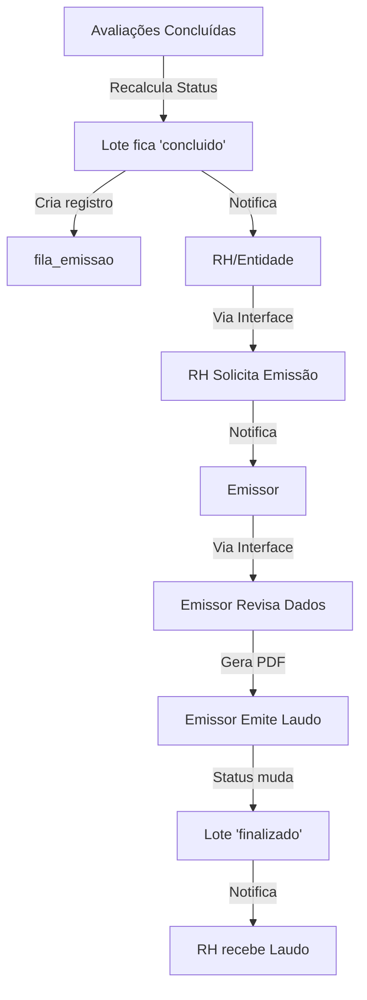

# ✅ RESUMO EXECUTIVO - Emissão Manual vs Automática

## 🎯 Descoberta Principal

**BOA NOTÍCIA**: O sistema JÁ ESTÁ CONFIGURADO para emissão MANUAL! ✅

Após análise detalhada do código em [lib/lotes.ts](lib/lotes.ts), confirmei que:

### ✅ O Que o Sistema FAZ (Correto)

Quando um lote é marcado como `status='concluido'`:

```typescript
// lib/lotes.ts - Linha 124-180
if (novoStatus === 'concluido') {
  // 1️⃣ Atualiza status do lote
  await query('UPDATE lotes_avaliacao SET status = $1 WHERE id = $2', [
    novoStatus,
    loteId,
  ]);

  // 2️⃣ Cria registro na fila de emissão (AGUARDANDO emissor)
  await query(
    `INSERT INTO fila_emissao (lote_id, solicitado_em)
     VALUES ($1, NOW())
     ON CONFLICT (lote_id) DO NOTHING`,
    [loteId]
  );

  // 3️⃣ Notifica RH/Entidade que lote está pronto
  await query(
    `INSERT INTO notificacoes (user_cpf, tipo, mensagem, lote_id, criado_em)
     SELECT liberado_por, 'lote_aguardando_solicitacao_emissao',
            'Lote ' || codigo || ' concluído - aguardando emissão do laudo', $1, NOW()
     FROM lotes_avaliacao WHERE id = $1`,
    [loteId]
  );
}
```

### ❌ O Que o Sistema NÃO FAZ (Correto)

**NÃO há chamada para `emitirLaudoImediato()` no código de recálculo de status!**

Isso significa que:

- ✅ Lote marca como 'concluido'
- ✅ Cria notificação
- ✅ Adiciona na fila de emissão
- ❌ **NÃO emite laudo automaticamente**

---

## 🔍 Código Legado Identificado

Apesar do fluxo principal estar correto, existem funções legadas que PODEM ser chamadas se alguém as invocar manualmente:

### 1. `lib/laudo-auto.ts` - `emitirLaudosAutomaticamente()`

**Status**: 🚨 ATIVA mas não é chamada automaticamente

```typescript
export async function emitirLaudosAutomaticamente() {
  console.log(
    '[FASE 1 - CRON] emitirLaudosAutomaticamente() chamado — wrapper de compatibilidade (deprecated)'
  );
  // ... código que BUSCARIA lotes concluídos e emitiria laudos
}
```

**Risco**: Se alguém chamar esta função (ex: via script), ela tentará emitir laudos automaticamente.

**Locais que chamam**:

- ❌ `scripts/emit-laudos-one.ts`
- ❌ `scripts/run-laudo-flow.ts`
- ✅ Testes (OK - ambiente de teste)

### 2. `lib/laudo-auto.ts` - `emitirLaudoImediato()`

**Status**: 🚨 ATIVA mas não é chamada pelo recálculo de status

```typescript
export async function emitirLaudoImediato(loteId: number): Promise<boolean> {
  // ... código que emite laudo sem ação manual
}
```

**Risco**: Se alguém chamar esta função diretamente, ela emitirá o laudo sem revisão do emissor.

---

## ✅ Correções Recomendadas

### Correção 1: Deprecar e Proteger Funções Legadas

**Objetivo**: Evitar que funções de emissão automática sejam chamadas acidentalmente.

**Arquivo**: `lib/laudo-auto.ts`

```typescript
/**
 * @deprecated SISTEMA DESCONTINUADO - NÃO UTILIZAR
 *
 * Emissão automática foi REMOVIDA do sistema por decisão operacional.
 * Laudos agora são emitidos MANUALMENTE pelo emissor após revisão.
 *
 * Esta função é mantida apenas para compatibilidade com código legado.
 * LANÇARÁ ERRO se chamada em produção.
 */
export async function emitirLaudosAutomaticamente() {
  const isProduction = process.env.NODE_ENV === 'production';
  const errorMsg =
    '[ERRO CRÍTICO] emitirLaudosAutomaticamente() foi chamada! ' +
    'Emissão automática está DESABILITADA por decisão operacional. ' +
    'Laudos devem ser emitidos manualmente pelo emissor.';

  console.error(errorMsg);

  // Em produção, bloquear execução
  if (isProduction) {
    // Registrar no audit log
    await query(
      `INSERT INTO audit_logs (acao, entidade, dados, user_role, criado_em)
       VALUES ('erro_sistema', 'emissao_automatica', $1, 'sistema', NOW())`,
      [
        JSON.stringify({
          erro: 'Tentativa bloqueada de emissão automática',
          stack: new Error().stack,
        }),
      ]
    );

    throw new Error(errorMsg);
  }

  // Em desenvolvimento/teste, apenas avisar
  console.warn('[AVISO] Função legada chamada em ambiente não-produção');
  return;
}

/**
 * @deprecated SISTEMA DESCONTINUADO - NÃO UTILIZAR
 *
 * Esta função emite laudo IMEDIATAMENTE sem revisão do emissor.
 * NÃO deve ser chamada em produção.
 */
export async function emitirLaudoImediato(loteId: number): Promise<boolean> {
  const isProduction = process.env.NODE_ENV === 'production';
  const errorMsg =
    `[ERRO CRÍTICO] emitirLaudoImediato(${loteId}) foi chamada! ` +
    'Emissão imediata está DESABILITADA. ' +
    'Use o fluxo manual: RH solicita → Emissor revisa → Emissor emite.';

  console.error(errorMsg);

  if (isProduction) {
    await query(
      `INSERT INTO audit_logs (acao, entidade, dados, user_role, criado_em)
       VALUES ('erro_sistema', 'emissao_imediata', $1, 'sistema', NOW())`,
      [
        JSON.stringify({
          erro: 'Tentativa bloqueada de emissão imediata',
          loteId,
          stack: new Error().stack,
        }),
      ]
    );

    throw new Error(errorMsg);
  }

  console.warn('[AVISO] Função legada chamada em ambiente não-produção');
  return false;
}
```

---

### Correção 2: Bloquear Scripts Legados

**Arquivos**:

- `scripts/emit-laudos-one.ts`
- `scripts/run-laudo-flow.ts`

**Adicionar no topo**:

```typescript
// scripts/emit-laudos-one.ts
console.error('='.repeat(80));
console.error('⚠️  SCRIPT DESCONTINUADO');
console.error('='.repeat(80));
console.error('');
console.error(
  'Este script usa emissão automática, que foi REMOVIDA do sistema.'
);
console.error('');
console.error('Fluxo correto:');
console.error('  1. Lote fica "concluido" (automático)');
console.error('  2. RH solicita emissão via interface');
console.error('  3. Emissor revisa e emite laudo manualmente');
console.error('');
console.error(
  'Se você precisa emitir laudos em lote, use a interface do emissor.'
);
console.error('');
console.error('='.repeat(80));
process.exit(1);
```

---

### Correção 3: Adicionar Comentários de Aviso

**Arquivo**: `scripts/injetar-avaliacoes-aleatorias.mjs`

```javascript
// Linha 346-350
// 7. Marcar lote como concluído
// ⚠️ IMPORTANTE: Isso NÃO emite laudo automaticamente!
// Após concluir este script, você deve:
//   1. Logar como RH
//   2. Solicitar emissão do laudo via interface
//   3. Logar como Emissor
//   4. Emitir laudo manualmente
console.log(`\n📋 Finalizando lote...\n`);
await client.query(
  `UPDATE lotes_avaliacao 
   SET status = 'concluido', finalizado_em = NOW(), atualizado_em = NOW()
   WHERE id = $1`,
  [loteId]
);
console.log(`   ✓ Lote marcado como 'concluido'\n`);
```

---

## 📋 Checklist de Implementação

### Prioridade ALTA (Fazer Agora)

- [x] ✅ Confirmar que `recalcularStatusLotePorId()` NÃO chama emissão automática
- [ ] 🔄 Adicionar guards em `emitirLaudosAutomaticamente()` e `emitirLaudoImediato()`
- [ ] 🔄 Bloquear scripts legados (`emit-laudos-one.ts`, `run-laudo-flow.ts`)
- [ ] 🔄 Adicionar comentários de aviso em `injetar-avaliacoes-aleatorias.mjs`
- [ ] 🔄 Testar que lote fica 'concluido' sem emitir laudo

### Prioridade MÉDIA (Próxima Sprint)

- [ ] 📝 Atualizar documentação do fluxo de emissão
- [ ] 📝 Criar guia para emissores sobre como emitir laudos manualmente
- [ ] 🧪 Atualizar testes que esperam emissão automática
- [ ] 🔍 Revisar APIs de monitoramento de emissão (deprecar se necessário)

### Prioridade BAIXA (Cleanup Futuro)

- [ ] 🗑️ Remover colunas `auto_emitir_agendado`, `auto_emitir_em` do banco (se não usadas)
- [ ] 🗑️ Remover arquivos de teste de emissão automática
- [ ] 🗑️ Remover código das funções legadas (manter stubs vazios)

---

## 🎓 Entendimento do Fluxo Atual

### Fluxo Manual Correto (Como Está Funcionando)



### O Que NÃO Acontece (E Está Correto)

```diff
- ❌ Lote 'concluido' → Emite laudo automaticamente
+ ✅ Lote 'concluido' → Aguarda solicitação manual
```

---

## 🚨 Riscos Residuais

### Risco 1: Scripts Chamados Manualmente

**Cenário**: Alguém executa `node scripts/emit-laudos-one.ts`

**Impacto**: Tentará emitir laudos automaticamente (bypassing revisão do emissor)

**Mitigação**:

- ✅ Adicionar guard que bloqueia execução em produção
- ✅ Bloquear scripts com `process.exit(1)`

### Risco 2: Chamada Direta das Funções

**Cenário**: Código novo importa e chama `emitirLaudoImediato(loteId)`

**Impacto**: Emissão sem revisão

**Mitigação**:

- ✅ Adicionar guards que lançam erro em produção
- ✅ Registrar no audit_log para rastreabilidade

### Risco 3: Colunas `auto_emitir_*` no Banco

**Cenário**: Código usa `auto_emitir_agendado` para decidir se emite

**Impacto**: Baixo (não encontrei uso ativo no fluxo principal)

**Mitigação**:

- 🔍 Revisar todas as queries que usam estas colunas
- 📋 Considerar remoção futura após confirmação

---

## ✅ Conclusão

### O Sistema Está Seguro

O fluxo principal de recálculo de status (`lib/lotes.ts`) **NÃO** aciona emissão automática. Ele apenas:

1. Marca lote como 'concluido'
2. Cria registro na fila de emissão
3. Notifica RH/Entidade

### Código Legado Existe Mas Não É Acionado

As funções de emissão automática existem, mas:

- ❌ **NÃO são chamadas** pelo fluxo normal do sistema
- ⚠️ **PODEM ser chamadas** se alguém executar scripts legados
- ✅ **DEVEM ser protegidas** com guards para evitar uso acidental

### Próximos Passos

1. ✅ Implementar guards nas funções legadas
2. ✅ Bloquear scripts que chamam emissão automática
3. ✅ Testar que o fluxo manual funciona corretamente
4. 📝 Documentar fluxo para equipe operacional

---

**Status**: ✅ **SISTEMA SEGURO** - Emissão é manual conforme planejado  
**Ação Necessária**: Proteger código legado para evitar chamadas acidentais

---

**Criado por**: GitHub Copilot  
**Data**: 31 de janeiro de 2026
