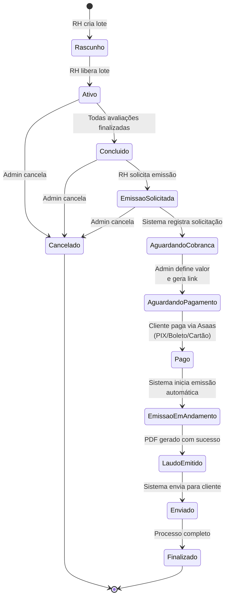

# 🔄 Máquina de Estados: Fluxo de Emissão de Laudos com Pagamento

## 📋 Resumo Executivo

**Problema Identificado:** O webhook handler estava tentando atualizar tabelas do sistema ANTIGO de planos/assinaturas (`tomadores` e `contratos`), causando erro de enum constraint e ROLLBACK da transação.

**Solução Implementada:** Removido código obsoleto, mantendo APENAS atualização de `lotes_avaliacao` (sistema ATUAL de pagamento por emissão).

**Data da Correção:** 16 de fevereiro de 2026

---

## 🗂️ Sistemas de Pagamento

### ❌ Sistema ANTIGO (Descontinuado)

- **Tabelas:** `tomadores`, `contratos`, `planos`
- **Enum:** `status_aprovacao_enum` = ('pendente', 'aprovado', 'rejeitado', 'em_reanalise')
- **Modelo:** Assinatura mensal com número fixo de funcionários
- **Status:** **OBSOLETO** - não deve mais ser usado

### ✅ Sistema ATUAL (Em Uso)

- **Tabela:** `lotes_avaliacao`
- **Enum de Pagamento:** `status_pagamento` = ('aguardando_cobranca', 'aguardando_pagamento', 'pago')
- **Enum de Status:** `status` (VARCHAR) = ('rascunho', 'ativo', 'concluido', 'emissao_solicitada', 'emissao_em_andamento', 'laudo_emitido', 'cancelado', 'finalizado')
- **Modelo:** Pagamento **por lote** - Cliente paga apenas quando solicita emissão de laudo
- **Status:** **ATIVO E CORRETO**

---

## 🔄 Máquina de Estados Completa



---

## 📊 Estados Detalhados

### 1️⃣ Estados do Lote (`status`)

| Estado                 | Descrição                                  | Próximo Estado Possível             |
| ---------------------- | ------------------------------------------ | ----------------------------------- |
| `rascunho`             | Lote criado, aguardando liberação          | `ativo`, `cancelado`                |
| `ativo`                | Lote liberado, avaliações em andamento     | `concluido`, `cancelado`            |
| `concluido`            | Todas avaliações finalizadas               | `emissao_solicitada`, `cancelado`   |
| `emissao_solicitada`   | RH solicitou emissão, aguardando pagamento | `emissao_em_andamento`, `cancelado` |
| `emissao_em_andamento` | Sistema processando emissão                | `laudo_emitido`                     |
| `laudo_emitido`        | PDF gerado com sucesso                     | `enviado` (via email/notificação)   |
| `cancelado`            | Lote cancelado pelo admin                  | `[FIM]`                             |
| `finalizado`           | Processo completo                          | `[FIM]`                             |

### 2️⃣ Estados de Pagamento (`status_pagamento`)

| Estado                 | Descrição                                            | Ação Necessária                   | Próximo Estado         |
| ---------------------- | ---------------------------------------------------- | --------------------------------- | ---------------------- |
| `aguardando_cobranca`  | RH solicitou emissão, aguardando admin definir valor | Admin define valor e gera link    | `aguardando_pagamento` |
| `aguardando_pagamento` | Link gerado, aguardando cliente pagar                | Cliente realiza pagamento         | `pago`                 |
| `pago`                 | Pagamento confirmado pelo Asaas                      | Sistema inicia emissão automática | `NULL` (não muda mais) |

---

## 🔗 Fluxo de Pagamento no Webhook Asaas

### Evento: `PAYMENT_CONFIRMED`

```typescript
// ANTES (ERRADO - Causava ROLLBACK)
UPDATE tomadores SET status = 'aprovado'  // ❌ Enum inválido
UPDATE contratos SET status = 'aprovado'  // ❌ Enum inválido

// DEPOIS (CORRETO)
UPDATE lotes_avaliacao
SET status_pagamento = 'pago',           // ✅ Enum válido
    pago_em = NOW(),
    pagamento_metodo = 'pix',
    pagamento_parcelas = 1
WHERE id = $loteId
```

### Colunas Atualizadas em `lotes_avaliacao`

| Coluna               | Tipo               | Valor Atualizado                  | Descrição              |
| -------------------- | ------------------ | --------------------------------- | ---------------------- |
| `status_pagamento`   | `status_pagamento` | `'pago'`                          | Confirma pagamento     |
| `pago_em`            | `TIMESTAMPTZ`      | `NOW()`                           | Timestamp do pagamento |
| `pagamento_metodo`   | `VARCHAR(20)`      | `'pix'` / `'boleto'` / `'cartao'` | Meio de pagamento      |
| `pagamento_parcelas` | `INTEGER`          | `1`                               | Número de parcelas     |

---

## 🎯 ExternalReference Format

O sistema identifica o lote através do campo `externalReference` no pagamento Asaas:

**Formato:** `lote_{LOTE_ID}_pagamento_{PAGAMENTO_ID}`

**Exemplo:** `lote_24_pagamento_34`

**Extração:**

```typescript
const loteIdMatch = externalReference.match(/lote_(\d+)/);
const loteId = loteIdMatch ? parseInt(loteIdMatch[1], 10) : null;
```

---

## 🛠️ Correções Implementadas

### Arquivo: `lib/asaas/webhook-handler.ts`

#### ❌ Removido (Linhas 338-360)

```typescript
// 4. Ativar o tomador
if (tomadorId) {
  await client.query(
    `UPDATE tomadores
     SET pagamento_confirmado = TRUE,
         ativa = TRUE,
         status = 'aprovado',  // ❌ ERRO: enum inválido
         atualizado_em = NOW()
     WHERE id = $1`,
    [tomadorId]
  );
}

// 5. Se houver contrato, atualizar status
if (contrato_id) {
  await client.query(
    `UPDATE contratos
     SET status = 'aprovado',  // ❌ ERRO: enum inválido
         pagamento_confirmado = TRUE,
         data_aceite = COALESCE(data_aceite, NOW()),
         data_pagamento = NOW(),
         atualizado_em = NOW()
     WHERE id = $1`,
    [contrato_id]
  );
}
```

#### ✅ Mantido (Linhas 307-334)

```typescript
// 3. Atualizar lote_avaliacao (SISTEMA ATUAL)
for (const lote of lotesResult.rows) {
  const updateResult = await client.query(
    `UPDATE lotes_avaliacao
     SET status_pagamento = 'pago',  // ✅ Enum válido
         pago_em = NOW(),
         pagamento_metodo = $1,
         pagamento_parcelas = 1
     WHERE id = $2
     RETURNING id, status_pagamento, pago_em, pagamento_metodo`,
    [paymentData.billingType?.toLowerCase() || 'pix', lote.id]
  );
}
```

---

## 🔍 Validação da Correção

### Antes da Correção

```log
[Asaas Webhook] 🔄 Atualizando lote 24...
[Asaas Webhook] ✅ Lote atualizado com sucesso: { lote_id: 24, status_pagamento: 'pago' }
[Asaas Webhook] 🔄 Ativando tomador 5...
[ERROR] valor inválido para status_aprovacao_enum: "aprovado"
[Asaas Webhook] ❌ ROLLBACK - Transação revertida
```

### Depois da Correção

```log
[Asaas Webhook] 🔄 Atualizando lote 24...
[Asaas Webhook] ✅ Lote atualizado com sucesso: { lote_id: 24, status_pagamento: 'pago' }
[Asaas Webhook] ✅ Webhook processado com sucesso
[Asaas Webhook] ✅ COMMIT - Transação confirmada
```

---

## 📝 Tabelas Relacionadas

### `lotes_avaliacao` (Tabela Principal)

```sql
CREATE TABLE lotes_avaliacao (
  id INTEGER PRIMARY KEY,
  clinica_id INTEGER,
  empresa_id INTEGER,
  entidade_id INTEGER,
  descricao TEXT,
  tipo VARCHAR(20) DEFAULT 'completo',
  status VARCHAR(20) DEFAULT 'rascunho',

  -- CAMPOS DE PAGAMENTO (Migration 800)
  status_pagamento status_pagamento,           -- aguardando_cobranca | aguardando_pagamento | pago
  solicitacao_emissao_em TIMESTAMPTZ,          -- Quando RH solicitou
  valor_por_funcionario DECIMAL(10,2),         -- Valor definido pelo admin
  link_pagamento_token UUID,                   -- Token único do link
  link_pagamento_enviado_em TIMESTAMPTZ,       -- Quando link foi gerado
  pagamento_metodo VARCHAR(20),                -- pix | boleto | cartao
  pagamento_parcelas INTEGER,                  -- 1-12 (só para cartão)
  pago_em TIMESTAMPTZ,                         -- Timestamp confirmação

  -- OUTROS CAMPOS
  liberado_por CHAR(11),
  liberado_em TIMESTAMPTZ,
  criado_em TIMESTAMPTZ DEFAULT NOW(),
  atualizado_em TIMESTAMPTZ DEFAULT NOW()
);
```

### `pagamentos` (Registro de Transações)

```sql
CREATE TABLE pagamentos (
  id SERIAL PRIMARY KEY,
  asaas_payment_id VARCHAR(50) UNIQUE,         -- ID do pagamento no Asaas
  asaas_customer_id VARCHAR(50),               -- ID do cliente no Asaas
  entidade_id INTEGER,
  clinica_id INTEGER,
  valor DECIMAL(10,2),
  status VARCHAR(20),                          -- processando | pago | cancelado
  data_pagamento TIMESTAMPTZ,
  dados_adicionais JSONB,
  criado_em TIMESTAMPTZ DEFAULT NOW()
);
```

---

## 🚀 Próximos Passos

Após pagamento confirmado (`status_pagamento = 'pago'`), o sistema deve:

1. **Mudar status do lote:** `concluido` → `emissao_em_andamento`
2. **Gerar PDF do laudo:** Processar todos os funcionários do lote
3. **Atualizar status:** `emissao_em_andamento` → `laudo_emitido`
4. **Enviar notificação:** Email/SMS para o cliente com link do PDF
5. **Finalizar:** `laudo_emitido` → `finalizado`

---

## ✅ Checklist de Validação

- [x] Removido código obsoleto de `tomadores`
- [x] Removido código obsoleto de `contratos`
- [x] Mantida atualização de `lotes_avaliacao`
- [x] Enum `status_pagamento` usado corretamente
- [x] Logs detalhados implementados
- [x] ExternalReference parseado corretamente
- [x] Transação COMMIT sem erros

---

## 📞 Suporte

Se encontrar problemas:

1. Verificar logs do webhook: `[Asaas Webhook]`
2. Consultar tabela `webhook_logs` para histórico
3. Verificar estado atual: `SELECT status, status_pagamento FROM lotes_avaliacao WHERE id = X`

---

**Autor:** Sistema Automatizado  
**Data:** 16/02/2026  
**Versão:** 1.0 - Correção Definitiva
