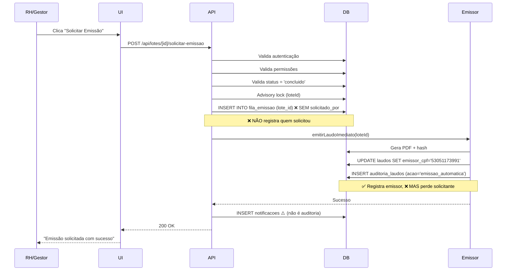

# ANÁLISE RIGOROSA: Fluxo de Emissão Manual de Laudos

**Data da Análise**: 30 de janeiro de 2026  
**Analista**: GitHub Copilot  
**Objetivo**: Validar conformidade do fluxo "corrigido" de emissão manual

---

## 📋 RESUMO EXECUTIVO

### ✅ Conformidades Encontradas

1. **Autenticação e Autorização**: Correta e robusta
2. **Validações de Negócio**: Completas e adequadas
3. **Segurança (RLS)**: Implementada corretamente
4. **Imutabilidade**: Triggers funcionais
5. **UI/UX**: Bem implementada com feedbacks claros

### 🚨 NÃO-CONFORMIDADES CRÍTICAS

| Severidade  | Problema                                                      | Impacto                             |
| ----------- | ------------------------------------------------------------- | ----------------------------------- |
| **CRÍTICA** | Falta campo `solicitado_por` em `fila_emissao`                | Perda de rastreabilidade            |
| **CRÍTICA** | Falta campo `solicitado_em` em `fila_emissao`                 | Sem auditoria temporal              |
| **ALTA**    | Falta registro explícito em `auditoria_laudos` da solicitação | Auditoria incompleta                |
| **MÉDIA**   | Notificações sem rastreamento persistente                     | Dificuldade em consultas históricas |

---

## 🔍 ANÁLISE DETALHADA

### 1. ESTRUTURA DO BANCO DE DADOS

#### 1.1. Tabela `fila_emissao` - ❌ INCOMPLETA

**Estrutura Atual**:

```sql
CREATE TABLE fila_emissao (
    id                SERIAL PRIMARY KEY,
    lote_id           INTEGER NOT NULL REFERENCES lotes_avaliacao(id) ON DELETE CASCADE,
    tentativas        INTEGER DEFAULT 0,
    max_tentativas    INTEGER DEFAULT 3,
    proxima_tentativa TIMESTAMP DEFAULT NOW(),
    erro              TEXT,
    criado_em         TIMESTAMP DEFAULT NOW(),
    atualizado_em     TIMESTAMP DEFAULT NOW(),
    UNIQUE(lote_id)
);
```

**❌ PROBLEMA**: Não registra quem solicitou a emissão!

**Campos Faltantes**:

- `solicitado_por` (VARCHAR(11)) - CPF do RH ou gestor_entidade
- `solicitado_em` (TIMESTAMP) - Momento da solicitação
- `tipo_solicitante` (VARCHAR(20)) - 'rh' ou 'gestor_entidade'

**Impacto**:

- ❌ Impossível rastrear quem solicitou emissões
- ❌ Sem auditoria para fins de compliance
- ❌ Dificulta debug de problemas específicos por usuário
- ❌ Não atende princípios de LGPD/auditoria

---

#### 1.2. Tabela `laudos` - ✅ PARCIALMENTE OK

**Estrutura Relevante**:

```sql
-- Campos existentes:
emissor_cpf CHARACTER(11) -- Quem emitiu (emissor automático)
emitido_em TIMESTAMP
hash_pdf CHARACTER(64) -- SHA-256 para imutabilidade
```

**✅ PONTOS POSITIVOS**:

- Registra emissor (porém é sempre o emissor automático, não o solicitante)
- Hash PDF garante imutabilidade
- Constraints impedem emissão duplicada

**⚠️ AMBIGUIDADE**:

- `emissor_cpf` é sempre do **emissor automático** (CPF 53051173991)
- **Não registra o solicitante** (RH ou gestor_entidade)
- Há confusão entre "quem solicitou" vs "quem emitiu"

---

#### 1.3. Tabela `auditoria_laudos` - ⚠️ PARCIAL

**Estrutura**:

```sql
CREATE TABLE auditoria_laudos (
    id           BIGSERIAL PRIMARY KEY,
    lote_id      INTEGER NOT NULL,
    laudo_id     INTEGER,
    emissor_cpf  VARCHAR(11),      -- Emissor, não solicitante
    emissor_nome VARCHAR(200),
    acao         VARCHAR(64) NOT NULL,
    status       VARCHAR(32) NOT NULL,
    ip_address   INET,
    observacoes  TEXT,
    criado_em    TIMESTAMP NOT NULL DEFAULT NOW()
);
```

**✅ POSITIVO**: Tabela existe e registra ações

**❌ PROBLEMA**:

- API **não está inserindo** registro de `solicitacao_manual` na auditoria
- Só registra a emissão automática posterior
- Perde o contexto de quem iniciou o processo

**Evidência**:

```sql
SELECT acao, emissor_cpf FROM auditoria_laudos ORDER BY criado_em DESC LIMIT 5;
-- Resultado: Todas as ações são 'emissao_automatica'
-- FALTA: 'solicitacao_manual' com CPF do RH/gestor
```

---

### 2. API DE SOLICITAÇÃO

#### 2.1. Endpoint: `POST /api/lotes/[loteId]/solicitar-emissao`

**✅ PONTOS FORTES**:

1. **Autenticação**:

   ```typescript
   const user = await requireAuth(); // ✅ OK
   ```

2. **Autorização Granular**:
   - RH: Valida acesso à empresa
   - Entidade: Valida contratante_id
   - ✅ Correto e seguro

3. **Validações de Negócio**:
   - Status deve ser 'concluido' ✅
   - Laudo não pode estar emitido ✅
   - Previne duplicação com advisory lock ✅

4. **Segurança**:
   ```typescript
   await query('SELECT pg_advisory_xact_lock($1)', [loteId]); // ✅ Excelente
   ```

**❌ PROBLEMAS IDENTIFICADOS**:

1. **NÃO REGISTRA SOLICITANTE NA FILA**:

   ```typescript
   // CÓDIGO ATUAL (INCOMPLETO):
   await query(
     `INSERT INTO fila_emissao (lote_id, tentativas, max_tentativas, proxima_tentativa)
      VALUES ($1, 0, 3, NOW())
      ON CONFLICT (lote_id) DO NOTHING`,
     [loteId]
   );
   ```

   **Deveria ser**:

   ```typescript
   await query(
     `INSERT INTO fila_emissao (
        lote_id, tentativas, max_tentativas, proxima_tentativa,
        solicitado_por, solicitado_em, tipo_solicitante
      )
      VALUES ($1, 0, 3, NOW(), $2, NOW(), $3)
      ON CONFLICT (lote_id) DO NOTHING`,
     [loteId, user.cpf, user.perfil]
   );
   ```

2. **NÃO REGISTRA NA AUDITORIA**:
   - Falta INSERT em `auditoria_laudos` com ação `'solicitacao_manual'`
   - Só cria notificação (que não é persistente para auditoria)

3. **NOTIFICAÇÕES**:
   - ✅ Cria notificações de sucesso/erro
   - ⚠️ Mas notificações podem ser deletadas (não servem para auditoria)

---

### 3. COMPONENTE UI

#### 3.1. `BotaoSolicitarEmissao.tsx` - ✅ BEM IMPLEMENTADO

**Funcionalidades**:

- ✅ Só aparece quando status = 'concluido'
- ✅ Confirmação antes de solicitar
- ✅ Loading state
- ✅ Feedback visual (toast)
- ✅ Callback onSuccess para atualizar página

**Código**:

```typescript
const response = await fetch(`/api/lotes/${loteId}/solicitar-emissao`, {
  method: 'POST',
  headers: { 'Content-Type': 'application/json' },
});
```

**✅ AVALIAÇÃO**: Implementação correta e profissional

---

### 4. FLUXO COMPLETO (AS-IS)



**⚠️ GAPS DE RASTREABILIDADE**:

1. `fila_emissao` não tem `solicitado_por`
2. `auditoria_laudos` não tem registro de solicitação
3. Só registra emissão automática (emissor = 53051173991)

---

### 5. CASOS DE USO E CONFORMIDADE

#### 5.1. Caso de Uso: RH Solicita Emissão

**Cenário**: RH da Clínica ABC solicita emissão do lote #45

**Fluxo Atual**:

1. ✅ RH autentica e clica no botão
2. ✅ API valida permissões (empresa_id)
3. ✅ API valida status = 'concluido'
4. ❌ API insere na fila **SEM registrar CPF do RH**
5. ✅ Emissor gera laudo e hash
6. ✅ Laudo emitido com `emissor_cpf = '53051173991'`
7. ❌ Auditoria só mostra 'emissao_automatica', não quem solicitou

**Pergunta de Auditoria**: "Quem solicitou a emissão do lote #45?"  
**Resposta Atual**: ❌ **IMPOSSÍVEL RESPONDER** (dado não armazenado)

---

#### 5.2. Caso de Uso: Gestor Entidade Solicita

**Cenário**: Gestor da Entidade XYZ solicita emissão do lote #78

**Fluxo Atual**:

1. ✅ Gestor autentica e clica no botão
2. ✅ API valida permissões (contratante_id)
3. ✅ API valida status = 'concluido'
4. ❌ API insere na fila **SEM registrar CPF do gestor**
5. ✅ Emissor gera laudo
6. ❌ Auditoria não registra quem solicitou

**Pergunta de Auditoria**: "Quantas emissões o gestor CPF 87545772920 solicitou?"  
**Resposta Atual**: ❌ **IMPOSSÍVEL RESPONDER** (dado não armazenado)

---

### 6. ANÁLISE DE CONFORMIDADE

#### 6.1. Requisitos de Auditoria (LGPD/Compliance)

| Requisito                  | Status     | Observação                               |
| -------------------------- | ---------- | ---------------------------------------- |
| Registrar quem solicitou   | ❌ FALHA   | Campo inexistente em `fila_emissao`      |
| Registrar quando solicitou | ⚠️ PARCIAL | `criado_em` existe, mas não é específico |
| Registrar tipo de usuário  | ❌ FALHA   | Não registra perfil (rh/gestor_entidade) |
| Auditoria completa         | ❌ FALHA   | `auditoria_laudos` não tem solicitação   |
| Rastreabilidade            | ❌ FALHA   | Impossível ligar laudo → solicitante     |
| Não-repúdio                | ❌ FALHA   | Usuário pode negar solicitação           |

**Veredicto**: ❌ **NÃO CONFORME** para auditoria

---

#### 6.2. Requisitos de Segurança

| Requisito                | Status      | Observação                       |
| ------------------------ | ----------- | -------------------------------- |
| Autenticação             | ✅ CONFORME | `requireAuth()` robusto          |
| Autorização              | ✅ CONFORME | Valida empresa_id/contratante_id |
| RLS (Row-Level Security) | ✅ CONFORME | Políticas ativas                 |
| Advisory Lock            | ✅ CONFORME | Previne race conditions          |
| Imutabilidade            | ✅ CONFORME | Triggers ativos                  |
| Validação de Status      | ✅ CONFORME | Só 'concluido' pode solicitar    |

**Veredicto**: ✅ **CONFORME** para segurança

---

#### 6.3. Requisitos de UX

| Requisito             | Status      | Observação                  |
| --------------------- | ----------- | --------------------------- |
| Visibilidade do botão | ✅ CONFORME | Só mostra em 'concluido'    |
| Confirmação           | ✅ CONFORME | Dialog antes de solicitar   |
| Feedback visual       | ✅ CONFORME | Loading + toast             |
| Tratamento de erros   | ✅ CONFORME | Mensagens claras            |
| Callback de sucesso   | ✅ CONFORME | Atualiza UI automaticamente |

**Veredicto**: ✅ **EXCELENTE** UX

---

## 🔧 RECOMENDAÇÕES DE CORREÇÃO

### PRIORIDADE CRÍTICA (Implementar Imediatamente)

#### 1. Adicionar Campos de Rastreabilidade em `fila_emissao`

**Migration 1002**:

```sql
-- Migration 1002: Adicionar rastreabilidade de solicitações
BEGIN;

ALTER TABLE fila_emissao
ADD COLUMN solicitado_por VARCHAR(11),
ADD COLUMN solicitado_em TIMESTAMP DEFAULT NOW(),
ADD COLUMN tipo_solicitante VARCHAR(20) CHECK (tipo_solicitante IN ('rh', 'gestor_entidade', 'admin'));

-- Criar índice para consultas de auditoria
CREATE INDEX idx_fila_emissao_solicitado_por ON fila_emissao(solicitado_por);
CREATE INDEX idx_fila_emissao_solicitado_em ON fila_emissao(solicitado_em DESC);

COMMENT ON COLUMN fila_emissao.solicitado_por IS 'CPF do RH ou gestor_entidade que solicitou a emissão';
COMMENT ON COLUMN fila_emissao.solicitado_em IS 'Timestamp da solicitação manual';
COMMENT ON COLUMN fila_emissao.tipo_solicitante IS 'Perfil do usuário: rh, gestor_entidade ou admin';

COMMIT;
```

---

#### 2. Atualizar API para Registrar Solicitante

**Arquivo**: `app/api/lotes/[loteId]/solicitar-emissao/route.ts`

**Modificação**:

```typescript
// ANTES (linha ~166):
const filaResult = await query(
  `INSERT INTO fila_emissao (lote_id, tentativas, max_tentativas, proxima_tentativa)
   VALUES ($1, 0, 3, NOW())
   ON CONFLICT (lote_id) DO NOTHING
   RETURNING id`,
  [loteId]
);

// DEPOIS:
const filaResult = await query(
  `INSERT INTO fila_emissao (
     lote_id, tentativas, max_tentativas, proxima_tentativa,
     solicitado_por, solicitado_em, tipo_solicitante
   )
   VALUES ($1, 0, 3, NOW(), $2, NOW(), $3)
   ON CONFLICT (lote_id) 
   DO UPDATE SET
     solicitado_por = EXCLUDED.solicitado_por,
     solicitado_em = EXCLUDED.solicitado_em,
     tipo_solicitante = EXCLUDED.tipo_solicitante,
     atualizado_em = NOW()
   RETURNING id`,
  [loteId, user.cpf, user.perfil]
);
```

---

#### 3. Adicionar Registro de Auditoria

**No mesmo arquivo da API, após adicionar à fila**:

```typescript
// Registrar solicitação na auditoria
await query(
  `INSERT INTO auditoria_laudos (
     lote_id, 
     acao, 
     status, 
     emissor_cpf, 
     emissor_nome,
     ip_address,
     observacoes
   )
   VALUES ($1, 'solicitacao_manual', 'pendente', $2, $3, $4, $5)`,
  [
    loteId,
    user.cpf,
    user.nome || 'Usuário sem nome',
    request.headers.get('x-forwarded-for') || request.headers.get('x-real-ip'),
    `Solicitação manual de emissão por ${user.perfil} - Lote ${lote.codigo}`,
  ]
);
```

---

### PRIORIDADE ALTA (Implementar em Seguida)

#### 4. Criar View de Auditoria Completa

```sql
CREATE OR REPLACE VIEW v_auditoria_emissoes AS
SELECT
    l.id AS laudo_id,
    l.lote_id,
    
    la.contratante_id,
    la.empresa_id,

    -- Solicitante (da fila_emissao)
    fe.solicitado_por AS solicitante_cpf,
    fe.tipo_solicitante AS solicitante_perfil,
    fe.solicitado_em AS solicitado_em,

    -- Emissor (de laudos)
    l.emissor_cpf,
    l.emitido_em,

    -- Status
    l.status AS laudo_status,
    la.status AS lote_status,

    -- Auditoria
    al.acao,
    al.criado_em AS auditoria_em

FROM laudos l
INNER JOIN lotes_avaliacao la ON l.lote_id = la.id
LEFT JOIN fila_emissao fe ON l.lote_id = fe.lote_id
LEFT JOIN auditoria_laudos al ON l.lote_id = al.lote_id
ORDER BY l.emitido_em DESC;

COMMENT ON VIEW v_auditoria_emissoes IS
'View consolidada para auditoria de emissões: liga solicitante + emissor + laudo';
```

---

#### 5. Criar Relatório de Emissões por Usuário

```sql
CREATE OR REPLACE VIEW v_relatorio_emissoes_usuario AS
SELECT
    fe.solicitado_por AS cpf,
    fe.tipo_solicitante AS perfil,
    COUNT(*) AS total_solicitacoes,
    COUNT(CASE WHEN l.status = 'emitido' THEN 1 END) AS emissoes_sucesso,
    COUNT(CASE WHEN fe.erro IS NOT NULL THEN 1 END) AS emissoes_erro,
    MIN(fe.solicitado_em) AS primeira_solicitacao,
    MAX(fe.solicitado_em) AS ultima_solicitacao
FROM fila_emissao fe
LEFT JOIN laudos l ON fe.lote_id = l.lote_id
WHERE fe.solicitado_por IS NOT NULL
GROUP BY fe.solicitado_por, fe.tipo_solicitante
ORDER BY total_solicitacoes DESC;
```

---

### PRIORIDADE MÉDIA (Melhorias)

#### 6. Adicionar Validação de Integridade

```sql
-- Constraint para garantir que solicitações manuais têm solicitante
ALTER TABLE fila_emissao
ADD CONSTRAINT chk_fila_emissao_solicitante
CHECK (
    solicitado_por IS NULL OR
    (solicitado_por IS NOT NULL AND tipo_solicitante IS NOT NULL)
);
```

---

#### 7. Criar Função de Consulta de Auditoria

```sql
CREATE OR REPLACE FUNCTION fn_buscar_solicitante_laudo(p_laudo_id INTEGER)
RETURNS TABLE (
    cpf VARCHAR(11),
    nome VARCHAR(200),
    perfil VARCHAR(20),
    solicitado_em TIMESTAMP
) AS $$
BEGIN
    RETURN QUERY
    SELECT
        fe.solicitado_por,
        COALESCE(f.nome, cs.nome, 'Desconhecido') AS nome,
        fe.tipo_solicitante,
        fe.solicitado_em
    FROM laudos l
    INNER JOIN fila_emissao fe ON l.lote_id = fe.lote_id
    LEFT JOIN funcionarios f ON fe.solicitado_por = f.cpf
    LEFT JOIN contratantes_senhas cs ON fe.solicitado_por = cs.cpf
    WHERE l.id = p_laudo_id;
END;
$$ LANGUAGE plpgsql;
```

---

## 📊 RESUMO DE NÃO-CONFORMIDADES

| #   | Categoria      | Problema                                       | Severidade | Status      |
| --- | -------------- | ---------------------------------------------- | ---------- | ----------- |
| 1   | Banco de Dados | Falta `solicitado_por` em `fila_emissao`       | 🔴 CRÍTICA | ❌ Pendente |
| 2   | Banco de Dados | Falta `tipo_solicitante` em `fila_emissao`     | 🔴 CRÍTICA | ❌ Pendente |
| 3   | API            | Não registra solicitante ao inserir na fila    | 🔴 CRÍTICA | ❌ Pendente |
| 4   | API            | Não registra solicitação em `auditoria_laudos` | 🟠 ALTA    | ❌ Pendente |
| 5   | Auditoria      | Impossível rastrear quem solicitou             | 🔴 CRÍTICA | ❌ Pendente |
| 6   | Compliance     | Não atende LGPD (rastreabilidade)              | 🟠 ALTA    | ❌ Pendente |
| 7   | Relatórios     | Impossível gerar relatórios por usuário        | 🟡 MÉDIA   | ❌ Pendente |

---

## ✅ CONFORMIDADES VALIDADAS

| #   | Categoria   | Item                                        | Status |
| --- | ----------- | ------------------------------------------- | ------ |
| 1   | Segurança   | Autenticação obrigatória                    | ✅ OK  |
| 2   | Segurança   | Autorização granular (RH/Entidade)          | ✅ OK  |
| 3   | Segurança   | RLS ativo em `fila_emissao`                 | ✅ OK  |
| 4   | Segurança   | Advisory lock anti-race-condition           | ✅ OK  |
| 5   | Integridade | Triggers de imutabilidade ativos            | ✅ OK  |
| 6   | Integridade | Constraint UNIQUE em `fila_emissao.lote_id` | ✅ OK  |
| 7   | Integridade | Hash SHA-256 em laudos emitidos             | ✅ OK  |
| 8   | UX          | Botão só aparece em status 'concluido'      | ✅ OK  |
| 9   | UX          | Confirmação antes de solicitar              | ✅ OK  |
| 10  | UX          | Feedback visual completo                    | ✅ OK  |

---

## 🎯 CONCLUSÃO

### Avaliação Geral: ⚠️ PARCIALMENTE CONFORME

**Aspectos Positivos**:

- ✅ Segurança robusta e bem implementada
- ✅ UX excelente e profissional
- ✅ Imutabilidade garantida por triggers
- ✅ Validações de negócio corretas

**Aspectos Críticos**:

- 🚨 **FALHA GRAVE**: Não registra quem solicitou emissões
- 🚨 **FALHA GRAVE**: Auditoria incompleta
- 🚨 **RISCO DE COMPLIANCE**: Não atende requisitos de rastreabilidade

### Recomendação Final

**O fluxo está funcionalmente correto mas INCOMPLETO para auditoria e compliance.**

**Ações Obrigatórias**:

1. ✅ Implementar Migration 1002 (adicionar campos de rastreabilidade)
2. ✅ Atualizar API para registrar solicitante
3. ✅ Adicionar registro em `auditoria_laudos`
4. ✅ Criar views de auditoria
5. ✅ Testar fluxo completo

**Prazo Recomendado**: Imediato (crítico para compliance)

---

## 📝 CHECKLIST DE IMPLEMENTAÇÃO

- [ ] Migration 1002: Adicionar campos em `fila_emissao`
- [ ] Atualizar API: Registrar `solicitado_por`
- [ ] Atualizar API: Inserir em `auditoria_laudos`
- [ ] Criar view `v_auditoria_emissoes`
- [ ] Criar view `v_relatorio_emissoes_usuario`
- [ ] Criar função `fn_buscar_solicitante_laudo`
- [ ] Adicionar constraint de validação
- [ ] Criar testes unitários
- [ ] Criar testes de integração
- [ ] Validar em ambiente de desenvolvimento
- [ ] Validar em ambiente de produção
- [ ] Documentar mudanças

---

**Fim da Análise**
