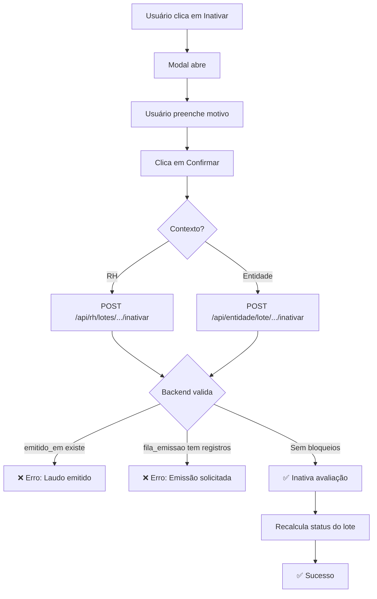

# Correção do Modal de Inativação de Avaliação

**Data:** 31/01/2025  
**Issue:** Modal mostrava erro "Inativação Bloqueada - Erro ao validar. Tente novamente"

## Problema Identificado

O `ModalInativarAvaliacao` estava tentando fazer uma validação prévia via GET para o endpoint `/api/avaliacoes/inativar?avaliacao_id=X`, que não existe mais no sistema. O sistema foi refatorado para usar rotas aninhadas específicas por contexto (RH e Entidade).

## Estrutura de Endpoints Atuais

### RH (Clínica)

```
POST /api/rh/lotes/[id]/avaliacoes/[avaliacaoId]/inativar
```

### Entidade (Contratante)

```
POST /api/entidade/lote/[id]/avaliacoes/[avaliacaoId]/inativar
```

## Alterações Implementadas

### 1. Modal de Inativação (`components/ModalInativarAvaliacao.tsx`)

#### Mudanças Principais:

- ✅ Adicionada prop `contexto: 'rh' | 'entidade'`
- ✅ Removida chamada GET de validação prévia
- ✅ Removidos estados desnecessários: `loading`, `validacao`, `forcar`, `confirmarPrioridadeAlta`
- ✅ Removida interface `ValidacaoResponse`
- ✅ Construção dinâmica do endpoint baseado no contexto
- ✅ Simplificação da UI - apenas formulário de motivo

#### Endpoint Dinâmico:

```typescript
const endpoint =
  contexto === 'rh'
    ? `/api/rh/lotes/${_loteId}/avaliacoes/${avaliacaoId}/inativar`
    : `/api/entidade/lote/${_loteId}/avaliacoes/${avaliacaoId}/inativar`;
```

#### Payload POST:

```json
{
  "motivo": "Texto do motivo da inativação"
}
```

### 2. Página RH (`app/rh/empresa/[id]/lote/[loteId]/page.tsx`)

```tsx
<ModalInativarAvaliacao
  avaliacaoId={modalInativar.avaliacaoId}
  funcionarioNome={modalInativar.funcionarioNome}
  funcionarioCpf={modalInativar.funcionarioCpf}
  _loteId={loteId}
  contexto="rh" // ✅ Nova prop
  onClose={() => setModalInativar(null)}
  onSuccess={loadLoteData}
/>
```

### 3. Página Entidade (`app/entidade/lote/[id]/page.tsx`)

```tsx
<ModalInativarAvaliacao
  avaliacaoId={modalInativar.avaliacaoId}
  funcionarioNome={modalInativar.funcionarioNome}
  funcionarioCpf={modalInativar.funcionarioCpf}
  _loteId={loteId}
  contexto="entidade" // ✅ Nova prop
  onClose={() => setModalInativar(null)}
  onSuccess={loadLoteData}
/>
```

## Validações no Backend

Ambos os endpoints (RH e Entidade) já implementam validações robustas:

### ✅ Validação 1: Laudo Já Emitido

```sql
SELECT emitido_em FROM lotes_avaliacao WHERE id = $1
```

- Se `emitido_em IS NOT NULL` → **BLOQUEIA** inativação
- Mensagem: "Não é possível inativar avaliações: laudo já foi emitido"

### ✅ Validação 2: Emissão Solicitada

```sql
SELECT COUNT(*) FROM fila_emissao WHERE lote_id = $1
```

- Se `count > 0` → **BLOQUEIA** inativação
- Mensagem: "Não é possível inativar avaliações: emissão do laudo já foi solicitada"

### ✅ Validação 3: Permissões

- **RH:** Verifica `clinica_id` via `requireRHWithEmpresaAccess`
- **Entidade:** Verifica `contratante_id` do usuário

## Princípio da Imutabilidade

O sistema implementa o **princípio da imutabilidade** para garantir integridade e rastreabilidade:

1. ✅ Após solicitar emissão do laudo → Avaliações são **imutáveis**
2. ✅ Após emitir o laudo → Avaliações são **imutáveis**
3. ✅ Todas as operações são auditadas via triggers

## Fluxo Correto de Inativação



## Arquivos Modificados

1. ✅ `components/ModalInativarAvaliacao.tsx` - Simplificação e correção de endpoints
2. ✅ `app/rh/empresa/[id]/lote/[loteId]/page.tsx` - Adicionado `contexto="rh"`
3. ✅ `app/entidade/lote/[id]/page.tsx` - Adicionado `contexto="entidade"`

## Arquivos Backend (Já Existentes - Não Modificados)

1. ✅ `app/api/rh/lotes/[id]/avaliacoes/[avaliacaoId]/inativar/route.ts`
2. ✅ `app/api/entidade/lote/[id]/avaliacoes/[avaliacaoId]/inativar/route.ts`

## Testes Recomendados

### Cenário 1: Inativação Permitida

- [ ] Lote sem emissão solicitada
- [ ] Lote não emitido
- [ ] Motivo com mínimo 10 caracteres
- [ ] **Resultado esperado:** ✅ Inativação bem-sucedida

### Cenário 2: Inativação Bloqueada - Emissão Solicitada

- [ ] Lote com registro em `fila_emissao`
- [ ] **Resultado esperado:** ❌ Erro: "emissão do laudo já foi solicitada"

### Cenário 3: Inativação Bloqueada - Laudo Emitido

- [ ] Lote com `emitido_em IS NOT NULL`
- [ ] **Resultado esperado:** ❌ Erro: "laudo já foi emitido"

### Cenário 4: Motivo Insuficiente

- [ ] Motivo com menos de 10 caracteres
- [ ] **Resultado esperado:** ⚠️ Alert antes do submit

### Cenário 5: Permissões - RH

- [ ] RH de clínica diferente tenta inativar
- [ ] **Resultado esperado:** ❌ Erro 403: "Acesso negado"

### Cenário 6: Permissões - Entidade

- [ ] Gestor de entidade diferente tenta inativar
- [ ] **Resultado esperado:** ❌ Erro 403: "Acesso negado"

## Benefícios da Refatoração

1. ✅ **Simplicidade:** Modal mais limpo e direto
2. ✅ **Consistência:** Validação centralizada no backend
3. ✅ **Segurança:** Princípio da imutabilidade garantido
4. ✅ **Manutenibilidade:** Menos estados e lógica complexa no frontend
5. ✅ **Auditoria:** Todas as operações registradas via triggers
6. ✅ **UX:** Mensagens de erro claras vindas do backend

## Notas Importantes

- 🔒 **Imutabilidade é obrigatória** após solicitação/emissão
- 📝 **Motivo mínimo:** 10 caracteres
- 🔍 **Auditoria automática** via triggers PostgreSQL
- 🚫 **Sem validação prévia:** Backend valida no POST
- ✅ **Recálculo automático** do status do lote após inativação
