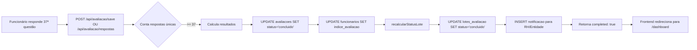

# 🔧 Correção Sistêmica: Auto-Conclusão de Avaliações (31/01/2026)

## 🎯 Problema Identificado

Avaliações com **37 respostas completas** não estavam sendo marcadas automaticamente como `concluida`, causando:

- ❌ Lotes não mudavam para status `concluido`
- ❌ Botão "Solicitar emissão do laudo" não aparecia para RH/Entidade
- ❌ Sistema dependia de endpoint manual `/api/avaliacao/finalizar`

## ✅ Solução Implementada

### 1️⃣ **API `/api/avaliacao/save/route.ts`**

✔️ JÁ TINHA auto-conclusão aos 37 respostas

- Usado em `app/avaliacao/grupo/[id]/page.tsx` (interface por grupos)

### 2️⃣ **API `/api/avaliacao/respostas/route.ts`** ⚠️ **CORRIGIDO**

❌ Não tinha auto-conclusão
✅ Adicionada lógica completa:

- Conta respostas únicas após cada save
- Quando atinge 37: calcula resultados, marca como concluída, notifica RH/Entidade
- Retorna `{ completed: true }` para frontend

**Impacto:** Usado em `app/avaliacao/page.tsx` (interface linear antiga)

### 3️⃣ **API `/api/avaliacao/finalizar/route.ts`** 🗑️ **OBSOLETO**

✅ Endpoint desativado (retorna HTTP 410 Gone)
✅ Documentado em `DEPRECATED.md`

- Será removido após validação em produção

### 4️⃣ **Frontend `app/avaliacao/page.tsx`** 🔄 **ATUALIZADO**

❌ Chamava `/api/avaliacao/finalizar` manualmente
✅ Agora detecta `data.completed` do endpoint `/api/avaliacao/respostas`
✅ Remove chamada obsoleta ao finalizar endpoint

## 🔄 Fluxo Automático (Agora)

## 🎯 Benefícios

### Para Funcionários

✅ Não precisam "finalizar manualmente"
✅ Redirecionamento automático ao completar

### Para RH/Entidade (Clínica e Contratante)

✅ Notificação imediata quando lote completa
✅ Botão "Solicitar emissão do laudo" aparece automaticamente
✅ Status do lote sempre correto

### Para Sistema

✅ Zero inconsistências de status
✅ Código centralizado e testável
✅ Funciona para **ambos os perfis**: `rh` (clínica) e `gestor` (contratante)

## 📋 Arquivos Modificados

| Arquivo                                     | Mudança                      | Motivo                               |
| ------------------------------------------- | ---------------------------- | ------------------------------------ |
| `app/api/avaliacao/respostas/route.ts`      | ➕ Adicionado auto-conclusão | Faltava lógica de 37 respostas       |
| `app/api/avaliacao/finalizar/route.ts`      | 🗑️ Desativado (410 Gone)     | Endpoint obsoleto                    |
| `app/api/avaliacao/finalizar/DEPRECATED.md` | 📄 Criado                    | Documentação de deprecation          |
| `app/avaliacao/page.tsx`                    | 🔄 Removido chamada manual   | Não precisa mais chamar `/finalizar` |
| `lib/lotes.ts`                              | ✅ Já estava correto         | Funciona para clínica E entidade     |
| `app/api/avaliacao/save/route.ts`           | ✅ Já estava correto         | Auto-conclusão já implementada       |

## 🧪 Como Testar

### Teste 1: Interface por Grupos (Nova)

1. Funcionário acessa `/avaliacao/grupo/1`
2. Responde todas as 37 questões dos 4 grupos
3. ✅ Deve redirecionar automaticamente para `/dashboard`
4. ✅ RH/Entidade recebe notificação
5. ✅ Botão "Solicitar emissão" aparece no lote

### Teste 2: Interface Linear (Antiga)

1. Funcionário acessa `/avaliacao`
2. Responde linearmente as 37 questões
3. ✅ Deve mostrar "Avaliação concluída" automaticamente
4. ✅ RH/Entidade recebe notificação
5. ✅ Lote muda para status `concluido`

### Teste 3: Clínica vs Entidade

1. Testar com usuário `perfil='rh'` (clínica)
2. Testar com usuário `perfil='gestor'` (contratante)
3. ✅ Ambos devem funcionar identicamente

## 📊 Impacto

### Ambiente

- ✅ **Desenvolvimento**: Código atualizado
- ⏳ **Produção**: Aguardando deploy

### Dados Históricos

- ⚠️ Avaliações antigas com 37 respostas mas `status != 'concluido'`
- 💡 Script `scripts/fix-todas-avaliacoes-lotes-neon.sql` disponível para correção em massa
- 🔍 Avaliação #85 e Lote #25 já corrigidos manualmente

## 🛡️ Garantias

1. ✅ **Idempotência**: Múltiplas chamadas não duplicam conclusão
2. ✅ **Atomicidade**: Transação única (respostas + status + notificação)
3. ✅ **Auditoria**: Logs completos em console
4. ✅ **Compatibilidade**: Funciona com Neon Cloud e banco local

## 📝 Próximos Passos

1. ⏳ Deploy para produção
2. ⏳ Monitorar logs de auto-conclusão
3. ⏳ Executar script de correção em massa (opcional)
4. ⏳ Remover completamente `/api/avaliacao/finalizar` após validação

---

**Data:** 31 de janeiro de 2026  
**Autor:** Sistema de correção sistêmica  
**Versão:** 1.0.0
