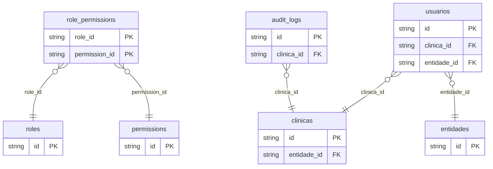

# DER do banco neondb_v2

Gerado em 27/04/2026 a partir de introspecao do schema public.

Resumo estrutural:
- 77 tabelas
- 91 foreign keys detectadas
- Cardinalidade representada de forma estrutural a partir das FKs. Onde nao ha constraint de unicidade adicional, a leitura mais segura e muitos-para-um do lado da tabela filha.

## 1. Nucleo operacional

```mermaid
erDiagram
  entidades {
    string id PK
  }

  entidade_configuracoes {
    string id PK
    string entidade_id FK
  }

  entidades_senhas {
    string id PK
    string entidade_id FK
  }

  clinicas {
    string id PK
    string entidade_id FK
  }

  clinicas_empresas {
    string clinica_id PK
    string empresa_id PK
  }

  empresas_clientes {
    string id PK
  }

  funcionarios {
    string id PK
    string cpf
    string ultima_avaliacao_id FK
  }

  funcionarios_clinicas {
    string id PK
    string funcionario_id FK
    string clinica_id FK
    string empresa_id FK
  }

  funcionarios_entidades {
    string id PK
    string funcionario_id FK
  }

  lotes_avaliacao {
    string id PK
    string empresa_id FK
    string entidade_id FK
  }

  avaliacoes {
    string id PK
    string funcionario_cpf FK
    string lote_id FK
  }

  analise_estatistica {
    string id PK
    string avaliacao_id FK
  }

  avaliacao_resets {
    string id PK
    string avaliacao_id FK
    string lote_id FK
  }

  confirmacao_identidade {
    string id PK
    string avaliacao_id FK
    string funcionario_cpf FK
  }

  respostas {
    string id PK
    string avaliacao_id FK
  }

  resultados {
    string id PK
    string avaliacao_id FK
  }

  laudos {
    string id PK
    string lote_id FK
  }

  laudo_arquivos_remotos {
    string id PK
    string laudo_id FK
  }

  laudo_downloads {
    string id PK
    string laudo_id FK
    string arquivo_remoto_id FK
  }

  laudo_generation_jobs {
    string id PK
    string lote_id FK
  }

  fila_emissao {
    string id PK
    string lote_id FK
  }

  emissao_queue {
    string id PK
    string lote_id FK
  }

  auditoria_laudos {
    string id PK
    string lote_id FK
  }

  importacao_templates {
    string id PK
    string clinica_id FK
    string entidade_id FK
  }

  importacoes_clinica {
    string id PK
    string clinica_id FK
  }

  mfa_codes {
    string id PK
    string cpf FK
  }

  clinicas }o--|| entidades : entidade_id
  entidade_configuracoes }o--|| entidades : entidade_id
  entidades_senhas }o--|| entidades : entidade_id
  clinicas_empresas }o--|| clinicas : clinica_id
  clinicas_empresas }o--|| empresas_clientes : empresa_id
  funcionarios }o--|| avaliacoes : ultima_avaliacao_id
  funcionarios_clinicas }o--|| funcionarios : funcionario_id
  funcionarios_clinicas }o--|| clinicas : clinica_id
  funcionarios_clinicas }o--|| empresas_clientes : empresa_id
  funcionarios_entidades }o--|| funcionarios : funcionario_id
  lotes_avaliacao }o--|| empresas_clientes : empresa_id
  lotes_avaliacao }o--|| entidades : entidade_id
  avaliacoes }o--|| funcionarios : funcionario_cpf
  avaliacoes }o--|| lotes_avaliacao : lote_id
  analise_estatistica }o--|| avaliacoes : avaliacao_id
  avaliacao_resets }o--|| avaliacoes : avaliacao_id
  avaliacao_resets }o--|| lotes_avaliacao : lote_id
  confirmacao_identidade }o--|| avaliacoes : avaliacao_id
  confirmacao_identidade }o--|| funcionarios : funcionario_cpf
  respostas }o--|| avaliacoes : avaliacao_id
  resultados }o--|| avaliacoes : avaliacao_id
  laudos }o--|| lotes_avaliacao : lote_id
  laudo_arquivos_remotos }o--|| laudos : laudo_id
  laudo_downloads }o--|| laudos : laudo_id
  laudo_downloads }o--|| laudo_arquivos_remotos : arquivo_remoto_id
  laudo_generation_jobs }o--|| lotes_avaliacao : lote_id
  fila_emissao }o--|| lotes_avaliacao : lote_id
  emissao_queue }o--|| lotes_avaliacao : lote_id
  auditoria_laudos }o--|| lotes_avaliacao : lote_id
  importacao_templates }o--|| clinicas : clinica_id
  importacao_templates }o--|| entidades : entidade_id
  importacoes_clinica }o--|| clinicas : clinica_id
  mfa_codes }o--|| funcionarios : cpf
```

## 2. Financeiro, laudos e comissionamento

```mermaid
erDiagram
  entidades {
    string id PK
  }

  clinicas {
    string id PK
    string entidade_id FK
  }

  empresas_clientes {
    string id PK
  }

  contratos {
    string id PK
  }

  lotes_avaliacao {
    string id PK
    string empresa_id FK
    string entidade_id FK
  }

  laudos {
    string id PK
    string lote_id FK
  }

  pagamentos {
    string id PK
    string clinica_id FK
    string contrato_id FK
    string empresa_id FK
  }

  recibos {
    string id PK
    string clinica_id FK
    string contrato_id FK
    string pagamento_id FK
  }

  pdf_jobs {
    string id PK
    string recibo_id FK
  }

  creditos_manutencao {
    string id PK
    string clinica_id FK
    string consumido_lote_id FK
    string empresa_id FK
    string entidade_id FK
    string pagamento_id FK
  }

  notificacoes_admin {
    string id PK
    string clinica_id FK
    string contrato_id FK
    string lote_id FK
    string pagamento_id FK
  }

  representantes {
    string id PK
    string bloqueio_conflito_pf_id FK
  }

  representantes_cadastro_leads {
    string id PK
    string representante_id FK
  }

  representantes_senhas {
    string id PK
    string representante_id FK
  }

  funcionarios {
    string id PK
  }

  usuarios {
    string id PK
    string clinica_id FK
    string entidade_id FK
  }

  vendedores_dados_bancarios {
    string id PK
    string usuario_id FK
  }

  vendedores_perfil {
    string id PK
    string usuario_id FK
  }

  leads_representante {
    string id PK
    string entidade_id FK
    string representante_id FK
    string vendedor_id FK
  }

  vinculos_comissao {
    string id PK
    string entidade_id FK
    string lead_id FK
    string representante_id FK
  }

  ciclos_comissao {
    string id PK
    string representante_id FK
  }

  comissoes_laudo {
    string id PK
    string ciclo_id FK
    string clinica_id FK
    string entidade_id FK
    string laudo_id FK
    string lote_pagamento_id FK
    string representante_id FK
    string vinculo_id FK
  }

  hierarquia_comercial {
    string id PK
    string comercial_id FK
    string representante_id FK
    string vendedor_id FK
  }

  auditoria_sociedade_pagamentos {
    string id PK
    string pagamento_id FK
  }

  auditoria_recibos {
    string id PK
    string recibo_id FK
  }

  laudos_storage_log {
    string id PK
    string clinica_id FK
    string entidade_id FK
    string laudo_id FK
    string lote_id FK
  }

  tokens_retomada_pagamento {
    string id PK
    string contrato_id FK
  }

  clinicas }o--|| entidades : entidade_id
  lotes_avaliacao }o--|| empresas_clientes : empresa_id
  lotes_avaliacao }o--|| entidades : entidade_id
  laudos }o--|| lotes_avaliacao : lote_id
  pagamentos }o--|| clinicas : clinica_id
  pagamentos }o--|| contratos : contrato_id
  pagamentos }o--|| empresas_clientes : empresa_id
  recibos }o--|| clinicas : clinica_id
  recibos }o--|| contratos : contrato_id
  recibos }o--|| pagamentos : pagamento_id
  pdf_jobs }o--|| recibos : recibo_id
  creditos_manutencao }o--|| clinicas : clinica_id
  creditos_manutencao }o--|| lotes_avaliacao : consumido_lote_id
  creditos_manutencao }o--|| empresas_clientes : empresa_id
  creditos_manutencao }o--|| entidades : entidade_id
  creditos_manutencao }o--|| pagamentos : pagamento_id
  notificacoes_admin }o--|| clinicas : clinica_id
  notificacoes_admin }o--|| contratos : contrato_id
  notificacoes_admin }o--|| lotes_avaliacao : lote_id
  notificacoes_admin }o--|| pagamentos : pagamento_id
  representantes }o--|| representantes : bloqueio_conflito_pf_id
  representantes_cadastro_leads }o--|| representantes : representante_id
  representantes_senhas }o--|| representantes : representante_id
  usuarios }o--|| clinicas : clinica_id
  usuarios }o--|| entidades : entidade_id
  vendedores_dados_bancarios }o--|| usuarios : usuario_id
  vendedores_perfil }o--|| usuarios : usuario_id
  leads_representante }o--|| entidades : entidade_id
  leads_representante }o--|| representantes : representante_id
  leads_representante }o--|| usuarios : vendedor_id
  vinculos_comissao }o--|| entidades : entidade_id
  vinculos_comissao }o--|| leads_representante : lead_id
  vinculos_comissao }o--|| representantes : representante_id
  ciclos_comissao }o--|| representantes : representante_id
  comissoes_laudo }o--|| ciclos_comissao : ciclo_id
  comissoes_laudo }o--|| clinicas : clinica_id
  comissoes_laudo }o--|| entidades : entidade_id
  comissoes_laudo }o--|| laudos : laudo_id
  comissoes_laudo }o--|| lotes_avaliacao : lote_pagamento_id
  comissoes_laudo }o--|| representantes : representante_id
  comissoes_laudo }o--|| vinculos_comissao : vinculo_id
  hierarquia_comercial }o--|| usuarios : vendedor_id
  hierarquia_comercial }o--|| representantes : representante_id
  hierarquia_comercial }o--|| funcionarios : comercial_id
  auditoria_sociedade_pagamentos }o--|| pagamentos : pagamento_id
  auditoria_recibos }o--|| recibos : recibo_id
  laudos_storage_log }o--|| clinicas : clinica_id
  laudos_storage_log }o--|| entidades : entidade_id
  laudos_storage_log }o--|| laudos : laudo_id
  laudos_storage_log }o--|| lotes_avaliacao : lote_id
  tokens_retomada_pagamento }o--|| contratos : contrato_id
```

## 3. Acesso, papeis e trilhas auxiliares

## 4. Tabelas sem FK explicita no schema

Essas tabelas possuem PK, mas nao expuseram relacoes por foreign key no schema public durante a introspecao:

- _migration_issues
- aceites_termos_entidade
- aceites_termos_usuario
- audit_access_denied
- audit_delecoes_tomador
- auditoria
- auditoria_geral
- beneficiarios_sociedade
- clinica_configuracoes
- clinicas_senhas
- comissionamento_auditoria
- configuracoes_gateway
- fk_migration_audit
- logs_admin
- migration_guidelines
- notificacoes
- notificacoes_traducoes
- policy_expression_backups
- questao_condicoes
- rate_limit_entries
- relatorio_templates
- schema_migrations
- session_logs
- templates_contrato
- webhook_logs

## 5. Chaves primarias especiais

As seguintes tabelas nao usam o padrao id como PK unica:

- clinicas_empresas: clinica_id + empresa_id
- configuracoes_gateway: codigo
- rate_limit_entries: key
- role_permissions: role_id + permission_id
- schema_migrations: version

## 6. Observacoes

- Algumas FKs apareceram duplicadas na introspecao bruta do information_schema; no diagrama elas foram deduplicadas.
- A relacao avaliacoes.funcionario_cpf -> funcionarios.cpf e estruturalmente valida, embora a PK formal de funcionarios seja id.
- Este material representa o schema public do banco remoto no momento da consulta. Mudancas posteriores em migrations ou triggers podem alterar o desenho.