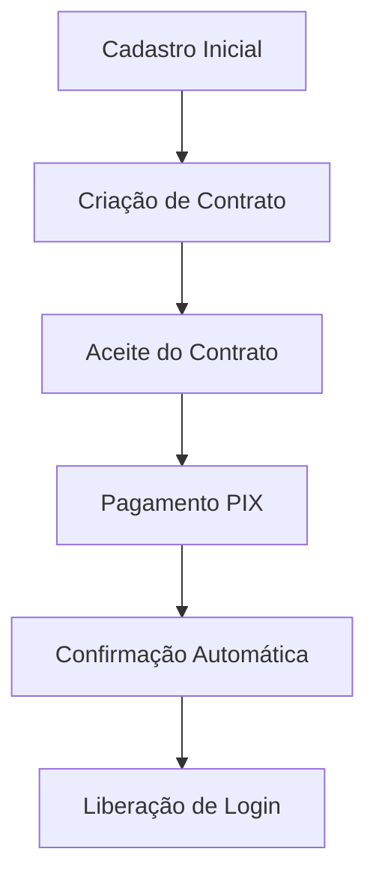
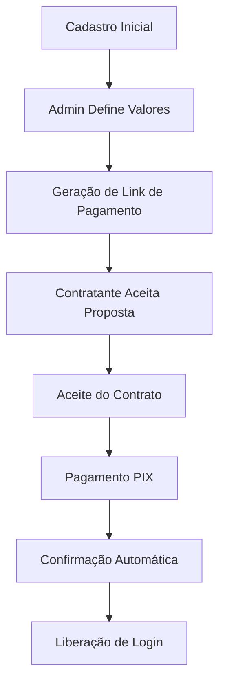

# Fluxo de Cadastro de Contratantes - Documentação Atualizada

**Última atualização:** 20/Janeiro/2026  
**Responsável:** Sistema de Documentação Automatizado

---

## Visão Geral

O sistema QWork implementa dois fluxos distintos para cadastro de contratantes (clínicas e entidades):

1. **Plano Fixo** (Contract-First): Contrato → Pagamento → Liberação de Login
2. **Plano Personalizado** (Personalização Admin): Cadastro → Admin Define Valores → Pagamento → Liberação de Login

---

## 1. Fluxo Plano Fixo (Contract-First)

### Etapas do Fluxo



### 1.1 Cadastro Inicial

**Endpoint:** `POST /api/cadastro/contratante`

**Dados obrigatórios:**

- `tipo`: "clinica" ou "entidade"
- `nome`, `cnpj`, `email`, `telefone`
- `endereco`, `cidade`, `estado`, `cep`
- `responsavel_nome`, `responsavel_cpf`, `responsavel_email`, `responsavel_celular`
- `plano_id`: ID do plano fixo selecionado
- `numero_funcionarios_estimado`: Quantidade de funcionários
- Anexos: `cartao_cnpj`, `contrato_social`, `doc_identificacao` (PDF/JPG/PNG, máx 5MB)

**Validações:**

- CNPJ único e válido
- Email único e válido
- CPF do responsável válido
- Número de funcionários dentro do limite do plano
- Arquivos em formato correto

**Resultado:**

```json
{
  "success": true,
  "id": 123,
  "requires_payment": true,
  "requires_contract_acceptance": true,
  "contrato_id": 456,
  "payment_info": {
    "valor_por_funcionario": 20.0,
    "numero_funcionarios": 50,
    "valor_total": 1000.0
  }
}
```

**Status inicial:** `aguardando_pagamento`

### 1.2 Criação Automática de Contrato

O sistema cria automaticamente um registro em `contratos`:

- `contratante_id`: ID do contratante
- `plano_id`: ID do plano fixo
- `numero_funcionarios`: Quantidade informada
- `valor_total`: Calculado (R$ 20,00 × número de funcionários)
- `status`: "aguardando_pagamento"
- `aceito`: false

**Arquivo:** [app/api/cadastro/contratante/route.ts](../../app/api/cadastro/contratante/route.ts#L510-L540)

### 1.3 Aceite do Contrato

**Endpoint:** `POST /api/contratos/aceitar`

**Payload:**

```json
{
  "contrato_id": 456
}
```

**Validação:**

- Contrato existe e pertence ao contratante
- Status permite aceite

**Resultado:**

- `contratos.aceito` = true
- `contratos.status` = "aguardando_pagamento"
- Redireciona para simulador de pagamento

### 1.4 Simulador de Pagamento PIX

**Endpoint:** `GET /pagamento/simulador?contratante_id=123&plano_id=1&numero_funcionarios=50`

**Gera:**

- QR Code PIX
- Código PIX Copia e Cola
- Timer de expiração (15 minutos)

**Registra em:** `registros_pagamento`

- `pix_qr_code`
- `pix_payload`
- `valor_total`
- `status`: "pendente"

### 1.5 Confirmação de Pagamento

**Webhook:** `POST /api/pagamento/webhook` (notificação da API PIX)

**Ações:**

1. Valida assinatura do webhook
2. Atualiza `registros_pagamento.status` = "confirmado"
3. Atualiza `contratantes.pagamento_confirmado` = true
4. Atualiza `contratos.status` = "pago"
5. Chama `ativarContratante()` que:
   - Define `contratantes.ativa` = true
   - Define `contratantes.status` = "aprovado"
   - Registra em `audit_logs`
   - Chama `criarContaResponsavel()`

### 1.6 Liberação de Login

**Função:** `criarContaResponsavel()`  
**Arquivo:** [lib/db.ts](../../lib/db.ts#L1342-L1450)

**Ações:**

1. Gera senha = últimos 6 dígitos do CNPJ
2. Hash da senha com bcrypt
3. Cria registro em `funcionarios`:
   - `nome`: responsavel_nome
   - `cpf`: responsavel_cpf
   - `email`: responsavel_email
   - `senha_hash`: bcrypt da senha
   - `perfil`: "entidade" ou "clinica"
   - `contratante_id`: ID do contratante
4. Envia email de boas-vindas com credenciais

**Status final:** `ativo` + login liberado

---

## 2. Fluxo Plano Personalizado

### Etapas do Fluxo



### 2.1 Cadastro Inicial

**Endpoint:** `POST /api/cadastro/contratante`

**Diferenças do plano fixo:**

- `plano_id`: ID do plano tipo "personalizado"
- `numero_funcionarios_estimado`: Opcional (pode ser informado depois pelo admin)

**Resultado:**

```json
{
  "success": true,
  "id": 123,
  "requires_payment": false,
  "message": "Cadastro realizado com sucesso! Aguarde análise do administrador."
}
```

**Status inicial:** `pendente`

**Registros criados:**

- `contratantes` (status: "pendente")
- `contratacao_personalizada` (status: "aguardando_valor_admin")

**Arquivo:** [app/api/cadastro/contratante/route.ts](../../app/api/cadastro/contratante/route.ts#L560-L575)

### 2.2 Admin Define Valores

**Endpoint:** `POST /api/admin/novos-cadastros`

**Ação:** `aprovar_personalizado`

**Payload:**

```json
{
  "acao": "aprovar_personalizado",
  "contratante_id": 123,
  "numero_funcionarios": 100,
  "valor_por_funcionario": 18.5
}
```

**Validações:**

- Contratante existe
- Plano é tipo "personalizado"
- Valores são positivos

**Ações:**

1. Calcula `valor_total_estimado` = valor_por_funcionario × numero_funcionarios
2. Atualiza `contratacao_personalizada`:
   - `valor_por_funcionario`
   - `numero_funcionarios_estimado`
   - `valor_total_estimado`
   - `status` = "valor_definido"
3. Gera token único (48h de validade)
4. Cria link: `/pagamento/personalizado/{token}`
5. Envia email para contratante com link

**Arquivo:** [app/api/admin/novos-cadastros/handlers.ts](../../app/api/admin/novos-cadastros/handlers.ts#L189-L340)

### 2.3 Contratante Acessa Link de Pagamento

**Endpoint:** `GET /api/proposta/[token]`

**Validações:**

- Token válido
- Token não expirado (< 48h)
- Status = "valor_definido"

**Exibe:**

- Dados do contratante
- Plano contratado
- Número de funcionários
- Valor por funcionário
- Valor total
- Botão "Aceitar Proposta"

**Arquivo:** [app/api/proposta/[token]/route.ts](../../app/api/proposta/[token]/route.ts)

### 2.4 Aceite da Proposta

**Endpoint:** `POST /api/proposta/aceitar`

**Payload:**

```json
{
  "contratacao_id": 456
}
```

**Ações:**

1. Valida status = "valor_definido"
2. Cria contrato em `contratos`:
   - `contratante_id`
   - `plano_id`
   - `numero_funcionarios`
   - `valor_total`
   - `status`: "aguardando_aceite"
   - `conteudo`: Contrato padrão personalizado
3. Atualiza `contratacao_personalizada.status` = "aguardando_aceite_contrato"
4. Redireciona para página de contrato

**Arquivo:** [app/api/proposta/aceitar/route.ts](../../app/api/proposta/aceitar/route.ts)

### 2.5 Aceite do Contrato

**Endpoint:** `POST /api/contratos/aceitar`

Mesmo fluxo do plano fixo (ver seção 1.3).

### 2.6 Pagamento e Confirmação

Mesmo fluxo do plano fixo (ver seções 1.4 e 1.5).

### 2.7 Liberação de Login

Mesmo fluxo do plano fixo (ver seção 1.6).

---

## 3. Arquivos e Módulos Principais

### 3.1 APIs de Cadastro

| Arquivo                                     | Responsabilidade                                       | Atualizado     |
| ------------------------------------------- | ------------------------------------------------------ | -------------- |
| `app/api/cadastro/contratante/route.ts`     | Cadastro inicial (fixo e personalizado)                | ✅ 18/jan/2026 |
| `app/api/admin/novos-cadastros/route.ts`    | Gestão de cadastros pendentes                          | ✅ 18/jan/2026 |
| `app/api/admin/novos-cadastros/handlers.ts` | Lógica de negócio (aprovar, rejeitar, definir valores) | ✅ 18/jan/2026 |
| `app/api/admin/novos-cadastros/schemas.ts`  | Validação com Zod                                      | ✅ 18/jan/2026 |

### 3.2 APIs de Proposta (Personalizado)

| Arquivo                             | Responsabilidade                         | Atualizado     |
| ----------------------------------- | ---------------------------------------- | -------------- |
| `app/api/proposta/[token]/route.ts` | Exibição de proposta por token           | ✅ 18/jan/2026 |
| `app/api/proposta/aceitar/route.ts` | Aceite de proposta e criação de contrato | ✅ 18/jan/2026 |

### 3.3 APIs de Contrato

| Arquivo                              | Responsabilidade   | Atualizado   |
| ------------------------------------ | ------------------ | ------------ |
| `app/api/contratos/aceitar/route.ts` | Aceite de contrato | 🔄 A revisar |

### 3.4 Bibliotecas Core

| Arquivo                         | Responsabilidade                                | Atualizado     |
| ------------------------------- | ----------------------------------------------- | -------------- |
| `lib/db.ts`                     | Funções de banco de dados                       | ✅ 18/jan/2026 |
| `lib/contratante-activation.ts` | Ativação segura de contratantes                 | ✅ 18/jan/2026 |
| `lib/cadastroContratante.ts`    | Utilitários de cadastro (formatação, validação) | ✅             |
| `lib/cadastroApi.ts`            | Cliente API para cadastro                       | ✅             |

### 3.5 Arquivos Obsoletos

| Arquivo                                      | Status          | Marcado em  |
| -------------------------------------------- | --------------- | ----------- |
| `app/api/admin/novos-cadastros/route.old.ts` | ⚠️ **OBSOLETO** | 20/jan/2026 |

**Motivo:** Código anterior a 18/jan/2026 com lógica duplicada e sem suporte aos novos fluxos.

---

## 4. Validações e Regras de Negócio

### 4.1 Validações no Cadastro

✅ **CNPJ:**

- Único no sistema
- Formato válido (14 dígitos)
- Dígitos verificadores corretos

✅ **Email:**

- Único no sistema
- Formato válido (regex)

✅ **CPF do Responsável:**

- Formato válido (11 dígitos)
- Dígitos verificadores corretos

✅ **Número de Funcionários:**

- Positivo
- Dentro do limite do plano (se plano fixo)

✅ **Arquivos:**

- Formatos permitidos: PDF, JPG, PNG
- Tamanho máximo: 5MB cada
- Obrigatórios: cartão CNPJ, contrato social, doc identificação

### 4.2 Regras de Ativação

⚠️ **CRÍTICO:** Contratante só pode ser ativado (`ativa = true`) se:

1. `pagamento_confirmado = true` **OU**
2. Isenção manual por admin (auditado)

**Função responsável:** `ativarContratante()` em [lib/contratante-activation.ts](../../lib/contratante-activation.ts)

### 4.3 Estados do Contratante

| Status                 | Descrição                                                     | Próximo passo        |
| ---------------------- | ------------------------------------------------------------- | -------------------- |
| `pendente`             | Cadastro inicial (personalizado)                              | Admin define valores |
| `aguardando_pagamento` | Cadastro completo (fixo) ou valores definidos (personalizado) | Pagamento            |
| `aprovado`             | Pagamento confirmado e contratante ativado                    | Uso do sistema       |
| `rejeitado`            | Cadastro rejeitado pelo admin                                 | -                    |
| `em_reanalise`         | Admin solicitou reanálise                                     | Correção de dados    |

### 4.4 Estados da Contratação Personalizada

| Status                       | Descrição                          | Próximo passo               |
| ---------------------------- | ---------------------------------- | --------------------------- |
| `aguardando_valor_admin`     | Cadastro inicial                   | Admin define valores        |
| `valor_definido`             | Admin definiu valores e gerou link | Contratante aceita proposta |
| `aguardando_aceite_contrato` | Proposta aceita, contrato criado   | Contratante aceita contrato |
| `pago`                       | Pagamento confirmado               | Ativação                    |

---

## 5. Auditoria e Logs

### 5.1 Eventos Auditados

Todos os eventos críticos são registrados em `audit_logs`:

- ✅ Cadastro de contratante
- ✅ Aprovação de cadastro
- ✅ Rejeição de cadastro
- ✅ Definição de valores (personalizado)
- ✅ Confirmação de pagamento
- ✅ Ativação de contratante
- ✅ Criação de conta responsável

### 5.2 Logs Estruturados

Formato JSON para facilitar análise:

```json
{
  "event": "cadastro_contratante_success",
  "contratante_id": 123,
  "plano_id": 1,
  "plano_tipo": "fixo",
  "requires_payment": true,
  "valor_total": 1000.0,
  "timestamp": "2026-01-20T10:30:00Z"
}
```

---

## 6. Segurança

### 6.1 Proteções Implementadas

✅ **SQL Injection:** Prepared statements em todas as queries  
✅ **XSS:** Sanitização de inputs  
✅ **CSRF:** Tokens de sessão httpOnly  
✅ **Validação:** Zod schemas para todas as APIs  
✅ **Auditoria:** Logs de todas as ações críticas  
✅ **RLS:** Row Level Security no PostgreSQL

### 6.2 Senha do Responsável

**Geração:** Últimos 6 dígitos do CNPJ  
**Armazenamento:** bcrypt hash (salt rounds: 10)  
**Envio:** Email seguro (TLS)  
**Recomendação:** Trocar na primeira login

---

## 7. Testes

### 7.1 Cobertura Atual

✅ Testes unitários  
✅ Testes de integração  
✅ Testes E2E  
✅ Testes de validação  
✅ Testes de segurança

### 7.2 Arquivos de Teste

- `__tests__/cadastro-contratante-completo.test.ts`
- `__tests__/integration/cadastro-personalizado-integration.test.ts`
- `__tests__/integration/cadastro-contratante-db.test.ts`
- `__tests__/api/cadastro-contratante-api.test.ts`
- `__tests__/api/cadastro-contratante-validation.test.ts`

---

## 8. Melhorias Futuras

### 8.1 Roadmap

- [ ] Pagamento com cartão de crédito
- [ ] Parcelamento
- [ ] Desconto para pagamento anual
- [ ] Renovação automática
- [ ] Dashboard de métricas de cadastro

### 8.2 Refatorações Pendentes

- [ ] Extrair lógica de email para serviço separado
- [ ] Implementar fila de jobs para ativação assíncrona
- [ ] Adicionar webhooks para notificações de status

---

## Contato e Suporte

**Dúvidas:** Consulte a equipe de desenvolvimento  
**Bugs:** Abra uma issue no repositório  
**Documentação:** Este arquivo + comentários no código

---

**Fim da documentação**
