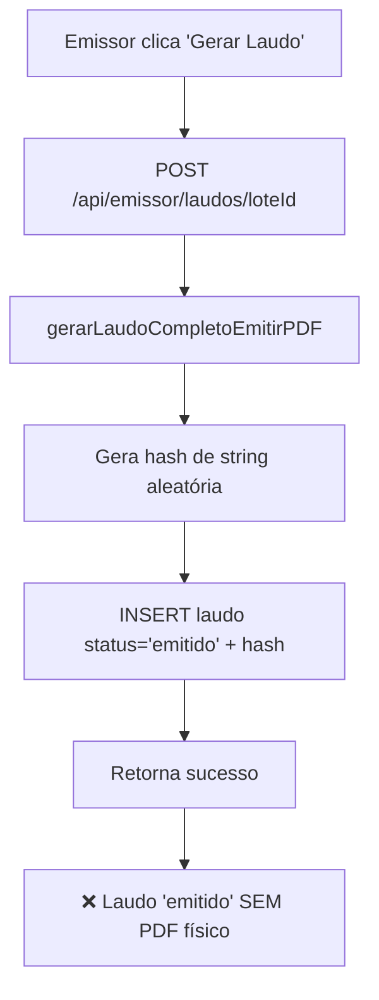
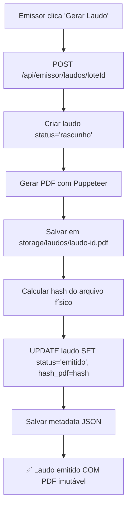

# 🚨 RELATÓRIO CRÍTICO: Violação do Princípio da Imutabilidade de Laudos

**Data:** 5 de fevereiro de 2026  
**Severidade:** CRÍTICA  
**Impacto:** Sistema permite laudos "emitidos" sem arquivo PDF físico

---

## ❌ PROBLEMA IDENTIFICADO

O sistema permite que um laudo tenha:

- `status = 'emitido'`
- `hash_pdf` preenchido
- `emitido_em` com timestamp

**SEM QUE O ARQUIVO PDF FÍSICO EXISTA EM `storage/laudos/laudo-{id}.pdf`**

Isso viola o princípio fundamental da imutabilidade: **um laudo só pode ser considerado "emitido" se o arquivo PDF físico existir e for imutável**.

---

## 🔍 CAUSA RAIZ

### Arquivo: `lib/laudo-auto.ts`

**Função:** `gerarLaudoCompletoEmitirPDF()`

```typescript
export async function gerarLaudoCompletoEmitirPDF(
  loteId: number,
  emissorCpf: string
): Promise<number> {
  // ❌ ERRO: Gera hash simulado sem PDF
  const hash = crypto
    .createHash('sha256')
    .update(`${loteId}:${Date.now()}`)
    .digest('hex');

  // ❌ ERRO CRÍTICO: INSERT com status='emitido' SEM gerar PDF físico
  const res = await query(
    `INSERT INTO laudos (id, lote_id, status, criado_em, emitido_em, emissor_cpf, hash_pdf)
     VALUES ($1, $1, 'emitido', NOW(), NOW(), $2, $3)
     ON CONFLICT (id) DO UPDATE 
     SET status = 'emitido', 
         emitido_em = NOW(), 
         emissor_cpf = $2, 
         hash_pdf = $3,
         atualizado_em = NOW()
     RETURNING id`,
    [loteId, emissorCpf, hash]
  );

  // ❌ RETORNA ID sem ter gerado PDF
  return res.rows[0].id;
}
```

**O que está errado:**

1. Hash é calculado de string aleatória, não do PDF real
2. Status 'emitido' é definido sem gerar arquivo físico
3. `emitido_em` é preenchido sem PDF
4. Não há geração de PDF nesta função
5. Não há persistência em `storage/laudos/`

---

## 📋 FLUXO ATUAL (ERRADO)



**Resultado:** Registro no banco diz "emitido" mas `storage/laudos/laudo-26.pdf` não existe.

---

## ✅ FLUXO CORRETO (A IMPLEMENTAR)



**Princípio:** PDF físico → Hash do arquivo → Status 'emitido'

---

## 🎯 ARQUIVOS QUE PRECISAM SER CORRIGIDOS

### 1. **lib/laudo-auto.ts** (PRIORIDADE MÁXIMA)

**Ação:** Reescrever completamente `gerarLaudoCompletoEmitirPDF()`

- ❌ Remover geração de hash fake
- ❌ Remover INSERT direto com status='emitido'
- ✅ Adicionar geração de PDF com Puppeteer
- ✅ Persistir PDF em storage/laudos/
- ✅ Calcular hash do arquivo físico
- ✅ SOMENTE ENTÃO atualizar para status='emitido'

### 2. **app/api/emissor/laudos/[loteId]/route.ts** (POST)

**Linha 386:** Chama `gerarLaudoCompletoEmitirPDF()`

- ✅ Manter chamada, mas garantir que função gera PDF
- ✅ Verificar que PDF existe antes de retornar sucesso

### 3. **app/api/emissor/laudos/[loteId]/pdf/route.ts** (GET)

**Ação:** Este endpoint JÁ está correto (gera PDF e persiste)

- ✅ Usar como referência para corrigir `gerarLaudoCompletoEmitirPDF()`
- ✅ Mantém imutabilidade: não regenera se PDF já existe

### 4. **app/api/entidade/laudos/[laudoId]/download/route.ts**

**Linha 52:** Busca PDF com fallback para Backblaze

- ✅ Já está correto (busca arquivo físico)
- ⚠️ Precisa garantir que laudo nunca esteja 'emitido' sem arquivo

### 5. **app/api/emissor/laudos/[loteId]/download/route.ts**

**Verificar:** Se existe este endpoint

- ✅ Se existir, garantir que busca arquivo físico
- ✅ Retornar 404 se laudo 'emitido' mas arquivo não existe

---

## 🗄️ BANCO DE DADOS - CONSTRAINTS A ADICIONAR

### Constraint 1: Verificar existência de arquivo antes de marcar como emitido

```sql
-- Adicionar função trigger que valida arquivo físico
CREATE OR REPLACE FUNCTION fn_validar_laudo_emitido()
RETURNS TRIGGER AS $$
BEGIN
  -- Se status mudou para 'emitido', validar que hash existe
  IF NEW.status = 'emitido' AND (NEW.hash_pdf IS NULL OR NEW.hash_pdf = '') THEN
    RAISE EXCEPTION 'Laudo não pode ser marcado como emitido sem hash_pdf';
  END IF;

  -- Se status mudou para 'emitido', validar que emitido_em existe
  IF NEW.status = 'emitido' AND NEW.emitido_em IS NULL THEN
    RAISE EXCEPTION 'Laudo não pode ser marcado como emitido sem emitido_em';
  END IF;

  RETURN NEW;
END;
$$ LANGUAGE plpgsql;

CREATE TRIGGER trg_validar_laudo_emitido
  BEFORE INSERT OR UPDATE ON laudos
  FOR EACH ROW
  EXECUTE FUNCTION fn_validar_laudo_emitido();
```

### Constraint 2: hash_pdf obrigatório quando status='emitido'

```sql
ALTER TABLE laudos
ADD CONSTRAINT chk_hash_when_emitido
CHECK (
  (status = 'emitido' AND hash_pdf IS NOT NULL AND hash_pdf != '')
  OR status != 'emitido'
);
```

### Constraint 3: emitido_em obrigatório quando status='emitido'

```sql
ALTER TABLE laudos
ADD CONSTRAINT chk_emitido_em_when_emitido
CHECK (
  (status = 'emitido' AND emitido_em IS NOT NULL)
  OR status != 'emitido'
);
```

---

## 📝 TESTES A CORRIGIR

### Testes que inserem laudos com status='emitido' sem PDF:

1. `__tests__/integration/manual-emission-flow.test.ts` (linha 105)
2. `__tests__/integration/fluxo-emissao-laudo.test.ts` (linha 137)
3. `__tests__/emissor/hash-backfill.test.ts` (linha 109)
4. `__tests__/emissor/manual-emission-flow.test.ts` (linha 93, 122)
5. `__tests__/entidade/entidade-fluxo-laudo-e2e.test.ts` (linha 309)
6. `__tests__/correcoes-31-01-2026/emissao-manual-fluxo.test.ts` (linha 193)

**Ação para todos:**

- ❌ Remover INSERT direto com status='emitido'
- ✅ Chamar função que gera PDF real
- ✅ Ou mockar geração de arquivo físico em testes

---

## 📚 DOCUMENTAÇÃO A ATUALIZAR

### Arquivos MD com informações desatualizadas:

1. `__tests__/correcoes-31-01-2026/VALIDACAO-EMISSAO-MANUAL.md`
2. `__tests__/correcoes-31-01-2026/RESULTADO-TESTES.md`
3. `__tests__/correcoes-31-01-2026/QUEM-PARTICIPA-FLUXO-MANUAL.md`
4. `docs/corrections/RELATORIO-CORRECAO-LAUDOS-2026-01-05.md`

**Ação:**

- Atualizar para refletir que status='emitido' SOMENTE após PDF físico

---

## 🔄 MIGRAÇÃO DE DADOS EXISTENTES

### Laudos com status='emitido' mas sem PDF físico:

```sql
-- Identificar laudos problemáticos
SELECT id, lote_id, status, hash_pdf, emitido_em
FROM laudos
WHERE status = 'emitido'
  AND (hash_pdf IS NULL OR hash_pdf = '');

-- Reverter para 'rascunho' até que PDF seja gerado
UPDATE laudos
SET status = 'rascunho',
    hash_pdf = NULL,
    emitido_em = NULL,
    atualizado_em = NOW()
WHERE status = 'emitido'
  AND id NOT IN (
    -- Listar IDs que TÊM arquivo físico
    -- (verificar manualmente em storage/laudos/)
  );
```

---

## ✅ CHECKLIST DE CORREÇÃO

### Código:

- [ ] Reescrever `lib/laudo-auto.ts::gerarLaudoCompletoEmitirPDF()`
- [ ] Adicionar geração de PDF com Puppeteer
- [ ] Adicionar persistência em storage/laudos/
- [ ] Calcular hash do arquivo físico real
- [ ] Atualizar status='emitido' SOMENTE após PDF salvo
- [ ] Adicionar geração de metadata JSON
- [ ] Validar que arquivo existe antes de retornar sucesso

### Banco de Dados:

- [ ] Criar trigger `fn_validar_laudo_emitido()`
- [ ] Adicionar constraint `chk_hash_when_emitido`
- [ ] Adicionar constraint `chk_emitido_em_when_emitido`
- [ ] Executar migração de dados existentes

### Testes:

- [ ] Corrigir todos os testes que inserem status='emitido' direto
- [ ] Adicionar testes que validam existência de PDF físico
- [ ] Adicionar teste que verifica constraints do banco

### Documentação:

- [ ] Atualizar MDs mencionados acima
- [ ] Documentar novo fluxo de emissão
- [ ] Atualizar diagramas de sequência

### Validação Final:

- [ ] Testar emissão manual completa
- [ ] Verificar que PDF existe em storage/
- [ ] Verificar que hash corresponde ao arquivo
- [ ] Tentar download por emissor/entidade/RH
- [ ] Verificar logs de imutabilidade

---

## 🚨 AÇÃO IMEDIATA REQUERIDA

1. **REVERTER laudos com status='emitido' sem PDF para 'rascunho'**
2. **IMPLEMENTAR geração de PDF em `lib/laudo-auto.ts`**
3. **ADICIONAR constraints no banco de dados**
4. **TESTAR fluxo completo end-to-end**

**Tempo estimado de correção:** 2-3 horas  
**Risco se não corrigir:** Laudos "emitidos" que não podem ser baixados, violação de conformidade, perda de integridade dos dados

---

## 📞 PRÓXIMOS PASSOS

1. Implementar correções em `lib/laudo-auto.ts`
2. Adicionar constraints no banco
3. Executar migração de dados
4. Corrigir testes
5. Validar fluxo completo
6. Atualizar documentação

**Status:** AGUARDANDO IMPLEMENTAÇÃO DAS CORREÇÕES
