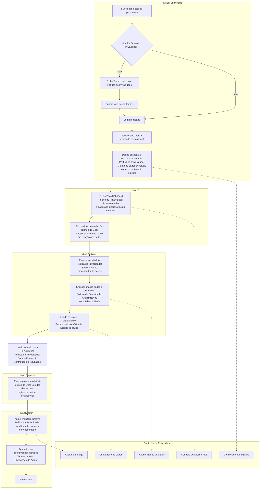

<!-- Moved from project root -->
# Fluxograma do Sistema Qwork - Foco em Política de Privacidade e Termos de Uso

Este fluxograma ilustra o fluxo do sistema de avaliação psicossocial Qwork, com ênfase na estruturação da Política de Privacidade e Termos de Uso, considerando todos os níveis de relacionamento: Administrador, Clínicas, RH, Empresas, Funcionários e Emissores.

## Explicação dos Pontos de Aplicação

### Política de Privacidade

- **Coleta de Dados**: Durante a avaliação, dados pessoais e psicossociais são coletados com consentimento explícito do funcionário.
- **Processamento**: Dados são processados anonimamente pelos emissores para geração de laudos.
- **Compartilhamento**: Laudos são compartilhados apenas com RH e empresas autorizadas, com controles de acesso.
- **Armazenamento**: Dados criptografados e auditados para conformidade com LGPD.

## Termos de Uso

- **Responsabilidades**: Cada nível tem responsabilidades definidas (RH gerencia lotes, Emissor emite laudos válidos, Admin garante conformidade).
- **Uso da Plataforma**: Define como os dados podem ser utilizados para saúde ocupacional.
- **Validade Jurídica**: Laudos têm validade jurídica para ações trabalhistas.

---

Este fluxograma destaca a integração das políticas em todos os níveis, assegurando privacidade e conformidade legal.
