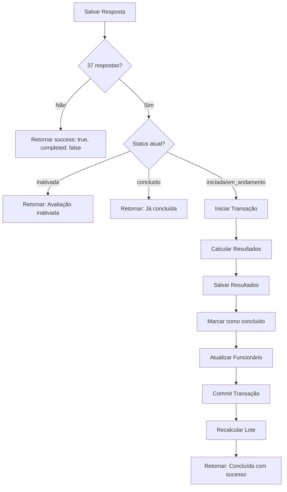

# Proteção para Auto-Conclusão de Avaliações

## Contexto

O sistema de avaliação psicossocial requer exatamente **37 respostas** para ser considerado completo (uma resposta por questão do questionário COPSOQ III).

## Proteções Implementadas

### 1. **Verificação de Completude**

- Sistema verifica automaticamente se todas as 37 questões foram respondidas
- Usa contagem de respostas únicas por `(grupo, item)` para evitar duplicatas

```typescript
const totalRespostas = parseInt(countResult.rows[0]?.total || '0');
// Se totalRespostas >= 37, avaliação está completa
```

### 2. **Validação de Status**

Antes de marcar como concluída, o sistema verifica:

- ✅ **Permite conclusão**: Se status é `'iniciada'` ou `'em_andamento'`
- ❌ **Bloqueia conclusão**: Se status é `'inativada'` (avaliação cancelada)
- ℹ️ **Idempotência**: Se status já é `'concluido'`, retorna sucesso sem tentar concluir novamente

```typescript
if (
  totalRespostas >= 37 &&
  statusAtual !== 'inativada' &&
  statusAtual !== 'concluido'
) {
  // Auto-conclusão permitida
}
```

### 3. **Transação Atômica**

Toda a operação de conclusão ocorre em uma transação única:

1. Buscar todas as respostas
2. Calcular resultados por grupo
3. Salvar resultados no banco
4. Marcar status como `'concluido'`
5. Atualizar índice do funcionário
6. Identificar lote para recálculo

Se qualquer etapa falhar, toda a transação é revertida (rollback).

### 4. **Tratamento de Erros Graceful**

- Erros no cálculo de resultados **não bloqueiam** a conclusão da avaliação
- Logs detalhados em cada etapa para diagnóstico
- Mensagens claras para diferentes cenários

### 5. **Recálculo Automático do Lote**

Após conclusão da avaliação:

- Sistema identifica o lote associado
- Trigger automático recalcula status do lote
- Verifica se lote pode ser marcado como concluído

## Fluxo de Auto-Conclusão



## Logs de Diagnóstico

### Sucesso na Auto-Conclusão

```
[RESPOSTAS] Avaliação 4 tem 37 respostas únicas
[RESPOSTAS] ✅ Avaliação 4 COMPLETA (37/37 respostas)! Status: em_andamento → concluido
[RESPOSTAS] ✅ Resultados calculados e salvos
[RESPOSTAS] ✅ Avaliação 4 marcada como concluída com sucesso
[RESPOSTAS] ✅ Funcionário atualizado | Lote 26 será recalculado automaticamente
[RESPOSTAS] ✅ Lote 26 recalculado
[RESPOSTAS] ✅ Avaliação 4 concluída automaticamente - 37/37 respostas recebidas
```

### Avaliação Já Concluída

```
[RESPOSTAS] Avaliação 4 tem 37 respostas únicas
[RESPOSTAS] ℹ️ Avaliação 4 já está concluída (37/37 respostas)
```

### Avaliação Inativada

```
[RESPOSTAS] Avaliação 4 tem 37 respostas únicas
[RESPOSTAS] ⚠️ Avaliação 4 está inativada e não pode ser concluída (37/37 respostas)
```

## Resposta da API

### Quando Auto-Concluída

```json
{
  "success": true,
  "completed": true,
  "message": "Avaliação concluída com sucesso! Todas as 37 questões foram respondidas."
}
```

### Quando Ainda Incompleta

```json
{
  "success": true,
  "completed": false
}
```

### Quando Inativada

```json
{
  "success": true,
  "completed": false,
  "message": "Avaliação inativada - não pode ser concluída."
}
```

## Benefícios

1. **Automático**: Usuário não precisa clicar em "Finalizar"
2. **Seguro**: Validações múltiplas evitam estados inconsistentes
3. **Idempotente**: Pode ser chamado múltiplas vezes sem efeitos colaterais
4. **Rastreável**: Logs detalhados facilitam diagnóstico
5. **Transacional**: Garante integridade dos dados

## Casos de Uso

### Cenário 1: Conclusão Normal

1. Funcionário responde questão 1-36
2. Funcionário responde questão 37
3. Sistema automaticamente marca como concluída ✅
4. Lote é recalculado
5. Se todas avaliações do lote estão concluídas, lote também é marcado como concluído

### Cenário 2: Avaliação Inativada

1. Gestor inativa avaliação após funcionário ter respondido 30 questões
2. Funcionário tenta responder questões restantes
3. Sistema permite salvar respostas (para auditoria)
4. **Mas não marca como concluída** ❌

### Cenário 3: Tentativa de Re-Conclusão

1. Avaliação já está concluída
2. Sistema recebe nova resposta (caso raro, possível tentativa de fraude)
3. Sistema ignora e retorna que já está concluída ℹ️

## Manutenção

### Alterando o Número de Questões

Se o questionário mudar de 37 para outro número:

1. Atualizar constante em `app/api/avaliacao/respostas/route.ts`:

```typescript
if (totalRespostas >= 37) { // ← Alterar este número
```

2. Atualizar documentação
3. Atualizar testes

### Monitoramento

Queries úteis para monitorar auto-conclusão:

```sql
-- Avaliações com 37 respostas mas não concluídas
SELECT a.id, a.status, COUNT(DISTINCT (r.grupo, r.item)) as respostas
FROM avaliacoes a
JOIN respostas r ON r.avaliacao_id = a.id
GROUP BY a.id
HAVING COUNT(DISTINCT (r.grupo, r.item)) >= 37 AND a.status != 'concluido';

-- Avaliações concluídas com menos de 37 respostas (anomalia)
SELECT a.id, a.status, COUNT(DISTINCT (r.grupo, r.item)) as respostas
FROM avaliacoes a
LEFT JOIN respostas r ON r.avaliacao_id = a.id
WHERE a.status = 'concluido'
GROUP BY a.id
HAVING COUNT(DISTINCT (r.grupo, r.item)) < 37;
```
