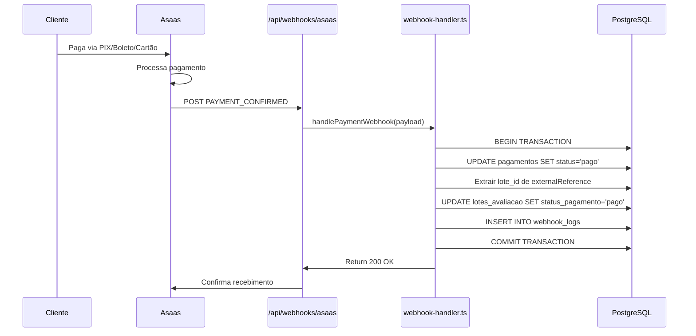

# 📊 RELATÓRIO: Estados do Sistema QWork × Mecanismo Asaas Payment Gateway

**Data do Relatório:** 17 de Fevereiro de 2026  
**Versão do Sistema:** 1.1.0  
**Última Atualização Crítica:** 16/02/2026 (Correção webhook)  
**Ambiente:** Produção (Vercel) + Local (Development)

---

## 📋 Índice

1. [Visão Geral da Integração](#visão-geral-da-integração)
2. [Máquina de Estados do Sistema](#máquina-de-estados-do-sistema)
3. [Estados de Pagamento (Asaas)](#estados-de-pagamento-asaas)
4. [Sincronização de Estados](#sincronização-de-estados)
5. [Eventos de Webhook](#eventos-de-webhook)
6. [Tipos de Cobrança](#tipos-de-cobrança)
7. [Fluxo Completo End-to-End](#fluxo-completo-end-to-end)
8. [Tabelas e Relacionamentos](#tabelas-e-relacionamentos)
9. [Logs e Monitoramento](#logs-e-monitoramento)
10. [Troubleshooting](#troubleshooting)

---

## 🎯 Visão Geral da Integração

### Modelo de Negócio Atual

O sistema QWork utiliza o modelo de **Pagamento por Emissão de Laudo**, onde:

- Cliente solicita emissão de laudo após concluir avaliações
- Admin define valor baseado no número de funcionários
- Sistema gera link de pagamento único via Asaas
- Cliente paga usando PIX, Boleto ou Cartão de Crédito
- Asaas confirma pagamento via webhook
- Sistema libera emissão automática do laudo

### Arquitetura de Integração

```
┌─────────────────────────────────────────────────────────────────┐
│                      SISTEMA QWORK                              │
│                                                                 │
│  ┌───────────────┐   ┌───────────────┐   ┌───────────────┐    │
│  │ Admin         │   │ RH/Gestor     │   │ Cliente       │    │
│  │ - Define valor│   │ - Solicita    │   │ - Paga        │    │
│  │ - Gera link   │   │   emissão     │   │ - Recebe PDF  │    │
│  └───────┬───────┘   └───────┬───────┘   └───────┬───────┘    │
│          │                   │                   │            │
│          ▼                   ▼                   ▼            │
│  ┌───────────────────────────────────────────────────────┐    │
│  │          lotes_avaliacao (Tabela Principal)           │    │
│  │  - status (VARCHAR)                                   │    │
│  │  - status_pagamento (ENUM)                            │    │
│  │  - valor_por_funcionario                              │    │
│  │  - link_pagamento_token (UUID)                        │    │
│  └───────────────────┬───────────────────────────────────┘    │
│                      │                                         │
└──────────────────────┼─────────────────────────────────────────┘
                       │
                       │ API REST + Webhook
                       ▼
┌─────────────────────────────────────────────────────────────────┐
│                    ASAAS PAYMENT GATEWAY                        │
│                                                                 │
│  ┌───────────────┐   ┌───────────────┐   ┌───────────────┐    │
│  │ Customer      │   │ Payment       │   │ Webhook       │    │
│  │ Management    │   │ Processing    │   │ Events        │    │
│  └───────────────┘   └───────────────┘   └───────────────┘    │
│                                                                 │
│  Métodos: PIX | Boleto | Cartão de Crédito                     │
└─────────────────────────────────────────────────────────────────┘
```

---

## 🔄 Máquina de Estados do Sistema

### Estados do Lote (`lotes_avaliacao.status`)

| Estado                   | Descrição                                           | Ação de Entrada                | Próximos Estados                    | Responsável          |
| ------------------------ | --------------------------------------------------- | ------------------------------ | ----------------------------------- | -------------------- |
| **rascunho**             | Lote criado, ainda não liberado para avaliações     | Usuário cria novo lote         | `ativo`, `cancelado`                | Sistema              |
| **ativo**                | Lote liberado, funcionários podem ser avaliados     | RH/Gestor libera lote          | `concluido`, `cancelado`            | RH/Gestor            |
| **concluido**            | Todas avaliações finalizadas, pronto para emissão   | Sistema detecta 100% concluído | `emissao_solicitada`, `cancelado`   | Sistema (automático) |
| **emissao_solicitada**   | RH solicitou emissão, aguardando fluxo de pagamento | RH clica "Solicitar Emissão"   | `emissao_em_andamento`, `cancelado` | RH/Gestor            |
| **emissao_em_andamento** | Sistema processando geração de PDF                  | Webhook confirma pagamento     | `laudo_emitido`                     | Sistema (automático) |
| **laudo_emitido**        | PDF gerado com sucesso, aguardando envio            | Sistema gera PDF               | `finalizado`                        | Sistema (automático) |
| **cancelado**            | Lote cancelado pelo admin                           | Admin cancela manualmente      | `[TERMINAL]`                        | Admin                |
| **finalizado**           | Processo completo, laudo enviado                    | Sistema envia laudo            | `[TERMINAL]`                        | Sistema (automático) |

### Estados de Pagamento (`lotes_avaliacao.status_pagamento`)

| Estado                   | Valor no DB            | Descrição                                            | Acionado Por                   | Próximo Estado         |
| ------------------------ | ---------------------- | ---------------------------------------------------- | ------------------------------ | ---------------------- |
| **Aguardando Cobrança**  | `aguardando_cobranca`  | RH solicitou emissão, aguardando admin definir preço | RH/Gestor solicita emissão     | `aguardando_pagamento` |
| **Aguardando Pagamento** | `aguardando_pagamento` | Link gerado, cliente ainda não pagou                 | Admin define valor + gera link | `pago`                 |
| **Pago**                 | `pago`                 | Pagamento confirmado pelo Asaas                      | Webhook `PAYMENT_CONFIRMED`    | `NULL` (estado final)  |

**⚠️ IMPORTANTE:** O campo `status_pagamento` utiliza o tipo ENUM PostgreSQL, aceitando APENAS os 3 valores listados acima.

---

## 💳 Estados de Pagamento (Asaas)

### Status do Asaas (`AsaasPaymentStatus`)

O Asaas utiliza uma máquina de estados própria para pagamentos:

| Status Asaas               | Descrição                              | Quando Ocorre                     | Ação no Sistema                         |
| -------------------------- | -------------------------------------- | --------------------------------- | --------------------------------------- |
| **PENDING**                | Aguardando pagamento                   | Cobrança criada                   | Manter `aguardando_pagamento`           |
| **CONFIRMED**              | Pagamento confirmado (cartão aprovado) | Pagamento via cartão autorizado   | ✅ Atualizar para `pago`                |
| **RECEIVED**               | Pagamento recebido (dinheiro na conta) | PIX confirmado, boleto compensado | ✅ Atualizar para `pago`                |
| **OVERDUE**                | Vencido                                | Data de vencimento passou         | ⚠️ Notificar cliente                    |
| **REFUNDED**               | Estornado                              | Admin estornou pagamento          | ❌ Reverter para `aguardando_pagamento` |
| **RECEIVED_IN_CASH**       | Recebido em dinheiro (fora Asaas)      | Admin marca como pago manualmente | ✅ Atualizar para `pago`                |
| **AWAITING_RISK_ANALYSIS** | Aguardando análise antifraude          | Pagamento suspeito                | ⏸️ Aguardar aprovação                   |
| **CHARGEBACK_REQUESTED**   | Cliente solicitou estorno              | Disputa de pagamento              | 🚨 Alerta para admin                    |

### Mapeamento Crítico

```typescript
// Estados que CONFIRMAM pagamento (liberam emissão)
CONFIRMED  → status_pagamento = 'pago' ✅
RECEIVED   → status_pagamento = 'pago' ✅

// Estados que REQUEREM ação
PENDING    → Aguardar (não atualizar)
OVERDUE    → Notificar cliente
REFUNDED   → Reverter status + notificar
```

---

## 🔗 Sincronização de Estados

### Fluxo de Sincronização (Webhook)



### Código de Sincronização

**Arquivo:** `lib/asaas/webhook-handler.ts` (Linhas 307-340)

```typescript
// Atualizar lote para 'pago'
const updateResult = await client.query(
  `UPDATE lotes_avaliacao
   SET status_pagamento = 'pago',
       pago_em = NOW(),
       pagamento_metodo = $1,
       pagamento_parcelas = 1
   WHERE id = $2
   RETURNING id, status_pagamento, pago_em, pagamento_metodo`,
  [paymentData.billingType?.toLowerCase() || 'pix', lote.id]
);
```

**Características:**

- ✅ Transação ACID (BEGIN → UPDATE → COMMIT)
- ✅ Enum válido utilizado (`status_pagamento = 'pago'`)
- ✅ Timestamp automático (`pago_em = NOW()`)
- ✅ Método de pagamento registrado
- ✅ Logs detalhados com emojis

---

## 📡 Eventos de Webhook

### Eventos Suportados pelo Sistema

O sistema QWork processa os seguintes eventos do Asaas:

| Evento                           | Prioridade | Ação no Sistema                    | Status          |
| -------------------------------- | ---------- | ---------------------------------- | --------------- |
| **PAYMENT_CREATED**              | 🔵 Baixa   | Atualizar status para 'CREATED'    | Implementado    |
| **PAYMENT_UPDATED**              | 🔵 Baixa   | Sincronizar dados                  | Implementado    |
| **PAYMENT_CONFIRMED**            | 🔴 CRÍTICA | ✅ Liberar emissão (status='pago') | ✅ Implementado |
| **PAYMENT_RECEIVED**             | 🔴 CRÍTICA | ✅ Liberar emissão (status='pago') | ✅ Implementado |
| **PAYMENT_OVERDUE**              | 🟡 Média   | Notificar cliente sobre vencimento | Implementado    |
| **PAYMENT_REFUNDED**             | 🟡 Média   | Reverter status + desativar acesso | Implementado    |
| **PAYMENT_REFUND_IN_PROGRESS**   | 🟡 Média   | Marcar em estorno                  | Implementado    |
| **PAYMENT_DELETED**              | 🔵 Baixa   | Atualizar status                   | Implementado    |
| **PAYMENT_RESTORED**             | 🔵 Baixa   | Restaurar status                   | Implementado    |
| **PAYMENT_CHARGEBACK_REQUESTED** | 🔴 Alta    | Alertar admin sobre disputa        | Implementado    |
| **PAYMENT_BANK_SLIP_VIEWED**     | 🔵 Info    | Log de rastreamento                | Implementado    |
| **PAYMENT_CHECKOUT_VIEWED**      | 🔵 Info    | Log de rastreamento                | Implementado    |

### Estrutura do Payload de Webhook

```typescript
interface AsaasWebhookPayload {
  event: AsaasWebhookEvent; // Ex: 'PAYMENT_CONFIRMED'
  payment: {
    id: string; // pay_xxxxxxxxxx
    customer: string; // cus_xxxxxxxxxx
    billingType: AsaasBillingType; // 'PIX' | 'BOLETO' | 'CREDIT_CARD'
    value: number; // 45.00
    netValue: number; // 42.50 (após taxas)
    status: AsaasPaymentStatus; // 'CONFIRMED'
    externalReference: string; // 'lote_24_pagamento_34'
    confirmedDate: string; // ISO 8601
    paymentDate: string; // ISO 8601
    dueDate: string; // YYYY-MM-DD
    description: string; // 'Emissão de Laudo - Lote #24'
    invoiceUrl: string; // URL da fatura
    // ... outros campos
  };
}
```

### ExternalReference (Rastreabilidade)

**Formato:** `lote_{LOTE_ID}_pagamento_{PAGAMENTO_ID}`

**Exemplo:** `lote_24_pagamento_34`

**Parsing:**

```typescript
function extractLoteIdFromExternalReference(
  externalRef?: string
): number | null {
  if (!externalRef) return null;
  const match = externalRef.match(/lote_(\d+)/);
  return match ? parseInt(match[1], 10) : null;
}
```

**Vantagens:**

- ✅ Vincula webhook ao lote específico
- ✅ Evita ambiguidade (múltiplos lotes com mesmo tomador)
- ✅ Permite rastreamento completo
- ✅ Fallback para busca por entidade_id se necessário

---

## 💰 Tipos de Cobrança

### Métodos de Pagamento Suportados

| Método                | Código Asaas  | Tempo de Confirmação   | Taxa Asaas | Parcelas | Status no Sistema |
| --------------------- | ------------- | ---------------------- | ---------- | -------- | ----------------- |
| **PIX**               | `PIX`         | Instantâneo (segundos) | ~0.5%      | Não      | ✅ Recomendado    |
| **Boleto**            | `BOLETO`      | 1-3 dias úteis         | R$ 3,49    | Não      | ✅ Aceito         |
| **Cartão de Crédito** | `CREDIT_CARD` | Instantâneo            | ~4.5%      | 1-12x    | ✅ Aceito         |
| **Cartão de Débito**  | `DEBIT_CARD`  | Instantâneo            | ~2.5%      | Não      | ⚠️ Não testado    |

### Configuração de Cobrança

**Arquivo:** `lib/asaas/client.ts`

```typescript
// Criar cobrança
const payment = await asaasClient.createPayment({
  customer: asaasCustomerId,
  billingType: 'PIX', // ou 'BOLETO', 'CREDIT_CARD'
  value: 45.0,
  dueDate: '2026-02-20',
  description: 'Emissão de Laudo - Lote #24',
  externalReference: 'lote_24_pagamento_34',

  // Opcional: desconto
  discount: {
    value: 5.0,
    dueDateLimitDays: 3,
    type: 'FIXED',
  },

  // Opcional: multa por atraso
  fine: {
    value: 2.0,
    type: 'PERCENTAGE',
  },

  // Opcional: juros ao mês
  interest: {
    value: 1.0,
    type: 'PERCENTAGE',
  },
});
```

### Parcelas (Cartão de Crédito)

```typescript
// Cartão em até 12x
{
  billingType: 'CREDIT_CARD',
  value: 240.00,
  installmentCount: 12,  // 12x de R$ 20,00
  installmentValue: 20.00
}
```

**Armazenamento:**

```sql
UPDATE lotes_avaliacao
SET pagamento_metodo = 'credit_card',
    pagamento_parcelas = 12
WHERE id = $loteId;
```

---

## 🔄 Fluxo Completo End-to-End

### Cenário 1: Pagamento via PIX (Fluxo Ideal)

```
1. RH/Gestor solicita emissão
   └─> UPDATE lotes_avaliacao SET status_pagamento = 'aguardando_cobranca'

2. Admin define valor (R$ 45,00 por funcionário)
   └─> UPDATE lotes_avaliacao SET valor_por_funcionario = 45.00

3. Admin gera link de pagamento
   ├─> POST /api/asaas/customers (cria/busca cliente)
   ├─> POST /api/asaas/payments (cria cobrança PIX)
   └─> UPDATE lotes_avaliacao SET
         status_pagamento = 'aguardando_pagamento',
         link_pagamento_token = UUID,
         link_pagamento_enviado_em = NOW()

4. Cliente acessa link e paga via PIX
   └─> Escaneia QR Code no app bancário
   └─> Realiza pagamento

5. Asaas detecta pagamento
   └─> Webhook POST /api/webhooks/asaas
       {
         "event": "PAYMENT_CONFIRMED",
         "payment": {
           "status": "CONFIRMED",
           "externalReference": "lote_24_pagamento_34"
         }
       }

6. Sistema processa webhook
   ├─> BEGIN TRANSACTION
   ├─> UPDATE pagamentos SET status = 'pago'
   ├─> UPDATE lotes_avaliacao SET
   │     status_pagamento = 'pago',
   │     pago_em = NOW(),
   │     pagamento_metodo = 'pix'
   ├─> INSERT INTO webhook_logs
   └─> COMMIT TRANSACTION

7. Sistema inicia emissão automática
   └─> UPDATE lotes_avaliacao SET status = 'emissao_em_andamento'
   └─> Gera PDF do laudo
   └─> UPDATE lotes_avaliacao SET status = 'laudo_emitido'
   └─> Envia email para cliente
   └─> UPDATE lotes_avaliacao SET status = 'finalizado'
```

**Tempo Total:** ~30 segundos (PIX instantâneo)

### Cenário 2: Pagamento via Boleto

```
Diferenças do fluxo PIX:

3. Admin gera link de pagamento
   └─> billingType = 'BOLETO'
   └─> dueDate = +7 dias

4. Cliente imprime boleto
   └─> Paga em banco/lotérica

5. Banco processa pagamento
   └─> Compensação: 1-3 dias úteis
   └─> Asaas recebe confirmação
   └─> Webhook PAYMENT_RECEIVED

6-7. Mesmo que PIX
```

**Tempo Total:** 1-3 dias úteis

### Cenário 3: Pagamento via Cartão de Crédito

```
Diferenças do fluxo PIX:

3. Admin gera link de pagamento
   └─> billingType = 'CREDIT_CARD'
   └─> installmentCount = 3 (3x sem juros)

4. Cliente preenche dados do cartão
   └─> Número, CVV, validade
   └─> Asaas processa com operadora

5. Operadora aprova
   └─> Asaas confirma imediatamente
   └─> Webhook PAYMENT_CONFIRMED

6-7. Mesmo que PIX
```

**Tempo Total:** ~1 minuto (aprovação instantânea)

---

## 🗄️ Tabelas e Relacionamentos

### Tabela Principal: `lotes_avaliacao`

```sql
CREATE TABLE lotes_avaliacao (
  -- Identificação
  id INTEGER PRIMARY KEY,
  numero_ordem INTEGER NOT NULL,

  -- Relacionamentos
  entidade_id INTEGER,
  clinica_id INTEGER,
  empresa_id INTEGER,
  liberado_por CHAR(11),  -- CPF do gestor

  -- Estados
  status VARCHAR(20) DEFAULT 'rascunho',
  status_pagamento status_pagamento,  -- ENUM

  -- Pagamento (Migration 800)
  solicitacao_emissao_em TIMESTAMPTZ,
  valor_por_funcionario DECIMAL(10,2),
  link_pagamento_token UUID UNIQUE,
  link_pagamento_enviado_em TIMESTAMPTZ,
  pagamento_metodo VARCHAR(20),
  pagamento_parcelas INTEGER,
  pago_em TIMESTAMPTZ,

  -- Timestamps
  criado_em TIMESTAMPTZ DEFAULT NOW(),
  atualizado_em TIMESTAMPTZ DEFAULT NOW(),
  liberado_em TIMESTAMPTZ,
  emitido_em TIMESTAMPTZ,
  enviado_em TIMESTAMPTZ,

  -- Constraints
  CONSTRAINT check_valor_positivo
    CHECK (valor_por_funcionario > 0 OR valor_por_funcionario IS NULL),
  CONSTRAINT check_parcelas_range
    CHECK (pagamento_parcelas BETWEEN 1 AND 12 OR pagamento_parcelas IS NULL)
);
```

### Tabela de Pagamentos: `pagamentos`

```sql
CREATE TABLE pagamentos (
  id SERIAL PRIMARY KEY,

  -- Asaas IDs
  asaas_payment_id VARCHAR(50) UNIQUE,
  asaas_customer_id VARCHAR(50),
  asaas_invoice_url TEXT,

  -- Relacionamento
  entidade_id INTEGER,
  clinica_id INTEGER,

  -- Dados do pagamento
  valor DECIMAL(10,2) NOT NULL,
  status VARCHAR(20),  -- 'pendente', 'pago', 'cancelado'
  metodo VARCHAR(20),  -- 'pix', 'boleto', 'credit_card'
  plataforma_nome VARCHAR(50) DEFAULT 'Asaas',

  -- Timestamps
  data_pagamento TIMESTAMPTZ,
  criado_em TIMESTAMPTZ DEFAULT NOW(),
  atualizado_em TIMESTAMPTZ DEFAULT NOW(),

  -- Dados adicionais (JSON)
  dados_adicionais JSONB
);
```

### Tabela de Logs: `webhook_logs`

```sql
CREATE TABLE webhook_logs (
  id SERIAL PRIMARY KEY,
  asaas_payment_id VARCHAR(50) NOT NULL,
  event VARCHAR(50) NOT NULL,
  payload JSONB,
  processed_at TIMESTAMPTZ DEFAULT NOW(),

  INDEX idx_webhook_payment (asaas_payment_id),
  INDEX idx_webhook_event (event),
  INDEX idx_webhook_processed (processed_at)
);
```

### Relacionamentos

```
lotes_avaliacao
    ├─> entidade_id → entidades.id
    ├─> clinica_id → clinicas.id
    ├─> empresa_id → empresas_clientes.id
    └─> liberado_por → entidades_senhas.cpf

pagamentos
    ├─> entidade_id → entidades.id
    ├─> clinica_id → clinicas.id
    └─> asaas_payment_id → Asaas Payment API

webhook_logs
    └─> asaas_payment_id → pagamentos.asaas_payment_id
```

---

## 📊 Logs e Monitoramento

### Estrutura de Logs

**Padrão de Log Implementado:**

```typescript
console.log('[Asaas Webhook] 📨 ========== WEBHOOK RECEBIDO ==========');
console.log('[Asaas Webhook] 🕒 Timestamp:', new Date().toISOString());
console.log('[Asaas Webhook] 🔑 Event:', payload.event);
console.log('[Asaas Webhook] 💳 Payment ID:', payload.payment?.id);
console.log('[Asaas Webhook] 📊 Status:', payload.payment?.status);
console.log(
  '[Asaas Webhook] 🎯 Lote identificado via externalReference:',
  loteId
);
console.log('[Asaas Webhook] ✅ Lote atualizado com sucesso');
console.log('[Asaas Webhook] ✅ COMMIT - Transação confirmada');
```

**Emojis Utilizados:**

- 📨 Webhook recebido
- 🔑 Chave/ID
- 💳 Pagamento
- 📊 Status/Dados
- 🎯 Identificação de lote
- ✅ Sucesso
- ❌ Erro
- ⚠️ Aviso
- 🔄 Processando
- 📝 Query SQL executada

### Monitoramento em Produção

**Vercel Logs:**

- URL: https://vercel.com/ronaldofilardos-projects/qwork/logs
- Filtros disponíveis:
  - `[Asaas Webhook]` - Todos logs de webhook
  - `ERROR` - Apenas erros
  - `PAYMENT_CONFIRMED` - Confirmações de pagamento
  - `ROLLBACK` - Transações falhadas (não deve ocorrer)

**Queries de Monitoramento:**

```sql
-- Webhooks processados nas últimas 24h
SELECT
  event,
  COUNT(*) as total,
  MAX(processed_at) as ultimo
FROM webhook_logs
WHERE processed_at > NOW() - INTERVAL '24 hours'
GROUP BY event
ORDER BY total DESC;

-- Lotes pagos nas últimas 24h
SELECT
  id,
  status_pagamento,
  pago_em,
  pagamento_metodo,
  valor_por_funcionario
FROM lotes_avaliacao
WHERE status_pagamento = 'pago'
AND pago_em > NOW() - INTERVAL '24 hours'
ORDER BY pago_em DESC;

-- Taxa de sucesso de webhooks (últimas 100 chamadas)
SELECT
  CASE
    WHEN payload->>'status' IN ('CONFIRMED', 'RECEIVED') THEN 'Sucesso'
    ELSE 'Pendente/Erro'
  END as resultado,
  COUNT(*) as total,
  ROUND(COUNT(*) * 100.0 / SUM(COUNT(*)) OVER(), 2) as percentual
FROM webhook_logs
WHERE event IN ('PAYMENT_CONFIRMED', 'PAYMENT_RECEIVED')
AND processed_at > NOW() - INTERVAL '7 days'
GROUP BY 1;
```

### Alertas Recomendados

| Condição                     | Severidade | Ação                                   |
| ---------------------------- | ---------- | -------------------------------------- |
| Erro de enum no webhook      | 🔴 P0      | Investigar imediatamente (bug crítico) |
| Tempo de processamento > 10s | 🟡 P2      | Otimizar queries                       |
| Webhook ROLLBACK             | 🔴 P0      | Corrigir código (transação falhou)     |
| Taxa de sucesso < 90%        | 🟡 P2      | Investigar padrão de falhas            |
| Pagamento duplicado          | 🟠 P1      | Verificar idempotência                 |

---

## 🛠️ Troubleshooting

### Problema 1: Lote não atualiza para 'pago'

**Sintomas:**

- Webhook retorna 200 OK
- Logs mostram "Webhook processado"
- Lote permanece `aguardando_pagamento`

**Diagnóstico:**

```sql
-- Verificar lote
SELECT id, status_pagamento, pago_em
FROM lotes_avaliacao
WHERE id = $LOTE_ID;

-- Verificar webhook
SELECT event, processed_at, payload
FROM webhook_logs
WHERE asaas_payment_id = '$PAYMENT_ID'
ORDER BY processed_at DESC;

-- Verificar se houve ROLLBACK
-- Buscar nos logs: "[Asaas Webhook] ❌ ROLLBACK"
```

**Soluções:**

1. ✅ Verificar enum correto (`status_pagamento = 'pago'`)
2. ✅ Confirmar que externalReference está correto
3. ✅ Validar que pagamento existe na tabela `pagamentos`
4. ✅ Reiniciar servidor Next.js (limpar cache)

### Problema 2: Erro de Enum Constraint

**Sintomas:**

```
ERROR: valor inválido para status_pagamento_enum: "aprovado"
```

**Causa Raiz:**

- Código tentando usar valor inválido do sistema ANTIGO
- Enum aceita apenas: 'aguardando_cobranca', 'aguardando_pagamento', 'pago'

**Solução:**

```typescript
// ❌ ERRADO
UPDATE tomadores SET status = 'aprovado'  // status_aprovacao_enum (obsoleto)

// ✅ CORRETO
UPDATE lotes_avaliacao SET status_pagamento = 'pago'  // status_pagamento enum
```

### Problema 3: Webhook duplicado

**Sintomas:**

- Múltiplos webhooks para mesmo pagamento
- Risco de processar 2x

**Solução (Idempotência):**

```typescript
// Verificar se já processado
const alreadyProcessed = await isWebhookProcessed(payment.id, event);
if (alreadyProcessed) {
  console.log('⚠️ Evento já processado. Ignorando.');
  return;
}

// Processar...

// Registrar como processado
await logWebhookProcessed(payment.id, event, payload);
```

### Problema 4: Timeout no Webhook

**Sintomas:**

- Asaas reenvia webhook várias vezes
- Logs mostram processamento lento

**Diagnóstico:**

```typescript
console.log('[Asaas Webhook] processedIn:', endTime - startTime, 'ms');
```

**Soluções:**

1. ✅ Responder 200 OK rapidamente (<30s)
2. ✅ Processar de forma assíncrona em produção
3. ✅ Otimizar queries (usar índices)
4. ✅ Considerar fila de processamento (Bull/BullMQ)

---

## 📈 Métricas de Sucesso

### KPIs a Monitorar

| Métrica                            | Meta | Como Medir                                   |
| ---------------------------------- | ---- | -------------------------------------------- |
| **Taxa de Sucesso de Webhook**     | >95% | Webhooks processados sem erro / Total        |
| **Tempo de Processamento**         | <5s  | `processedIn` no response                    |
| **Taxa de Pagamentos Confirmados** | >90% | Pagamentos com status 'pago' / Total criados |
| **Erros de Enum**                  | 0    | Buscar "enum" nos logs de erro               |
| **Transações ROLLBACK**            | 0    | Buscar "ROLLBACK" nos logs                   |
| **Tempo de Sincronização**         | <10s | Tempo entre pagamento e atualização no DB    |

### Dashboard Recomendado (SQL)

```sql
-- Visão geral de pagamentos (últimos 7 dias)
SELECT
  DATE(pago_em) as data,
  COUNT(*) as total_pagamentos,
  SUM(valor_por_funcionario) as receita_total,
  AVG(valor_por_funcionario) as ticket_medio,
  STRING_AGG(DISTINCT pagamento_metodo, ', ') as metodos_usados
FROM lotes_avaliacao
WHERE status_pagamento = 'pago'
AND pago_em > NOW() - INTERVAL '7 days'
GROUP BY DATE(pago_em)
ORDER BY data DESC;
```

---

## ✅ Checklist de Validação

### Pré-Deploy

- [ ] Enum `status_pagamento` configurado corretamente
- [ ] Migration 800 executada
- [ ] Variáveis de ambiente configuradas (ASAAS_API_KEY)
- [ ] Webhook URL configurada no Asaas Sandbox
- [ ] Testes de integração executados

### Pós-Deploy

- [ ] Webhook endpoint acessível (200 OK)
- [ ] Primeiro pagamento de teste confirmado
- [ ] Lote atualizado para 'pago'
- [ ] Logs sem erros de enum
- [ ] Transação commitada (sem ROLLBACK)

---

## 📚 Referências

### Documentação Relacionada

- [ANALISE-MAQUINA-ESTADOS-EMISSAO-LAUDO.md](ANALISE-MAQUINA-ESTADOS-EMISSAO-LAUDO.md)
- [BUILD_APPROVAL_WEBHOOK_FIX_16-02-2026.md](BUILD_APPROVAL_WEBHOOK_FIX_16-02-2026.md)
- [DEPLOY_PROD_CONFIRMACAO_16-02-2026.md](DEPLOY_PROD_CONFIRMACAO_16-02-2026.md)
- [Migration 800](database/migrations/800_add_payment_flow_to_lotes.sql)

### Documentação Externa

- [Asaas API Docs](https://docs.asaas.com/)
- [Asaas Webhooks](https://docs.asaas.com/reference/webhooks)
- [Asaas Payment Status](https://docs.asaas.com/reference/payment-status)

---

**Gerado em:** 17 de Fevereiro de 2026  
**Versão:** 1.0  
**Autor:** Sistema Automatizado QWork  
**Ambiente:** Produção (Vercel) + Desenvolvimento (Local)

---

**Status Atual:** 🟢 Sistema OPERACIONAL e SINCRONIZADO com Asaas
