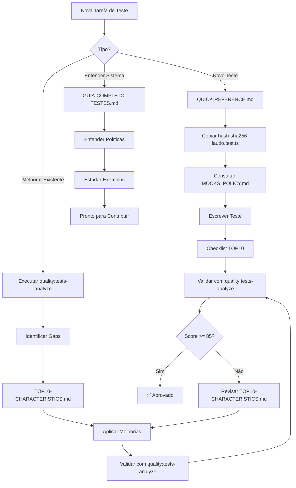

# Documentação de Testes - Índice Master

> Sistema unificado de testes com padrões de qualidade, políticas de mocks e ferramentas de análise.

---

## 📚 Documentação Principal

### 1. [GUIA-COMPLETO-TESTES.md](./GUIA-COMPLETO-TESTES.md)

**Guia Completo de Testes**  
Documentação extensiva cobrindo todos os aspectos de testes no projeto.

- ✅ Estrutura completa de testes
- ✅ Convenções de nomenclatura
- ✅ Fixtures e setup global
- ✅ Testes de API, lógica de negócio, componentes
- ✅ Padrões de qualidade integrados
- ✅ Exemplos práticos

**Quando usar**: Como referência principal para qualquer tipo de teste.

---

### 2. [MOCKS_POLICY.md](./MOCKS_POLICY.md)

**Política de Mocks e Padrões de Qualidade**  
Política oficial do projeto para criação de mocks e padrões de qualidade de código de teste.

- ✅ **Seção 1-4**: Política de Mocks (original)
  - Quando mockar vs não mockar
  - Padrões de implementação
  - Validação com `validate-mock-policy.cjs`
- ✅ **Seção 5**: Padrões de Qualidade de Código de Teste (novo)
  - 10 características de testes excelentes
  - Sistema de pontuação 0-100
  - Checklist de qualidade
  - Referências cruzadas

**Quando usar**: Para decisões sobre mocks e como escrever testes de alta qualidade.

---

### 3. [MOCKS_POLICY_EXAMPLE.test.tsx](./MOCKS_POLICY_EXAMPLE.test.tsx)

**Exemplo Prático da Política de Mocks**  
Código de exemplo demonstrando aplicação da política de mocks.

- ✅ Exemplos práticos de mocks corretos
- ✅ Anti-patterns comentados
- ✅ Padrões recomendados

**Quando usar**: Como template de implementação de mocks.

---

## 🎯 Sistema de Qualidade

### Ferramentas

#### [analyze-test-quality.cjs](../../scripts/analyze-test-quality.cjs)

Script de análise automática de qualidade de testes.

```bash
# Analisar todos os testes
pnpm quality:tests-analyze

# Saída: __tests__/quality-report.json
```

**Funcionalidades**:

- ✅ Analisa 494 testes
- ✅ Gera score 0-100 por arquivo
- ✅ Identifica top e bottom 10
- ✅ Métricas agregadas do projeto

#### [validate-mock-policy.cjs](../../scripts/validate-mock-policy.cjs)

Validador de conformidade com política de mocks.

```bash
# Validar política de mocks
pnpm validate:mocks
```

---

### Documentação de Qualidade

#### [TOP10-CHARACTERISTICS.md](../../__tests__/TOP10-CHARACTERISTICS.md)

**Guia Detalhado das 10 Características de Qualidade**

2000+ linhas com exemplos before/after, templates e checklists.

**10 Características**:

1. ✅ **JSDoc Completo** (+20 pontos)
2. ✅ **Imports de Tipos** (+15 pontos)
3. ✅ **beforeEach Cleanup** (+15 pontos)
4. ✅ **Comentários AAA** (+10 pontos)
5. ✅ **Mocks Tipados** (+10 pontos)
6. ✅ **Sem console.log** (+10 pontos)
7. ✅ **Assertions com Mensagens** (+10 pontos)
8. ✅ **Documentação de Casos** (+5 pontos)
9. ✅ **TODO com Contexto** (+3 pontos)
10. ✅ **Setup em beforeEach** (+2 pontos)

**Quando usar**: Para melhorar testes específicos e entender padrões de qualidade.

---

#### [QUICK-REFERENCE.md](../../__tests__/QUICK-REFERENCE.md)

Referência rápida (60 segundos) dos padrões de qualidade.

**Quando usar**: Consulta rápida durante desenvolvimento.

---

## 📁 Estrutura de Testes

### [INDEX.md](../../__tests__/INDEX.md)

Índice master do diretório `__tests__/`.

- ✅ Navegação por categoria
- ✅ Links para todos os arquivos
- ✅ Estrutura organizacional

---

### [INVENTORY.md](../../__tests__/INVENTORY.md)

Inventário completo dos 494 testes.

- ✅ Lista completa de arquivos
- ✅ Categorização
- ✅ Análise de cobertura

---

### [QUICKSTART.md](../../__tests__/QUICKSTART.md)

Guia de início rápido.

- ✅ Comandos essenciais
- ✅ Estrutura básica
- ✅ Primeiros passos

---

### [SANITIZATION-GUIDE.md](../../__tests__/SANITIZATION-GUIDE.md)

Processo completo de sanitização de testes.

- ✅ Metodologia passo a passo
- ✅ Ferramentas e scripts
- ✅ Checklist de sanitização

---

### [SANITIZATION-REPORT.md](../../__tests__/SANITIZATION-REPORT.md)

Relatório de progresso da sanitização.

- ✅ Métricas de antes/depois
- ✅ Progresso por categoria
- ✅ Próximos passos

---

## 🎓 Exemplos de Testes Exemplares

### Template Perfeito (Score 100/100)

[hash-sha256-laudo.test.ts](../../tests/api/emissor/laudos/hash-sha256-laudo.test.ts)

**Por que é perfeito**:

- ✅ JSDoc completo com @description e @test
- ✅ Imports de tipos explícitos
- ✅ beforeEach com limpeza completa
- ✅ Comentários AAA em cada teste
- ✅ Mocks tipados
- ✅ Zero console.log
- ✅ Todas as assertions com mensagens
- ✅ Documentação de casos de borda

**Uso**: Copie este arquivo como template para novos testes.

---

### Outros Exemplos de Alta Qualidade

#### Lógica Complexa

[recalculo-emissao-inativadas.test.ts](../../__tests__/lib/recalculo-emissao-inativadas.test.ts)

- Lógica de negócio complexa
- Múltiplos cenários
- Edge cases bem documentados

#### Segurança

[protecao-senhas.test.ts](../../__tests__/seguranca/protecao-senhas.test.ts)

- Testes de criptografia
- Validação de hashing
- Verificação de políticas de senha

#### RLS/RBAC

[rls-rbac.test.ts](../../__tests__/security/rls-rbac.test.ts)

- Row Level Security
- Políticas de acesso
- Permissões por role

---

## 📊 Métricas Atuais do Projeto

### Status Geral (494 testes analisados)

| Característica           | % Adoção | Meta |
| ------------------------ | -------- | ---- |
| JSDoc Completo           | 48%      | 90%  |
| Imports de Tipos         | 0.6%     | 80%  |
| beforeEach Cleanup       | 62%      | 95%  |
| Comentários AAA          | 15%      | 70%  |
| Mocks Tipados            | 35%      | 85%  |
| Sem console.log          | 78%      | 98%  |
| Assertions com Mensagens | 42%      | 80%  |

**Score Médio**: 55/100  
**Meta do Projeto**: 70+/100

---

## 🚀 Como Usar Este Sistema

### Para Novos Testes

1. Leia [QUICK-REFERENCE.md](../../__tests__/QUICK-REFERENCE.md) (60 segundos)
2. Copie [hash-sha256-laudo.test.ts](../../tests/api/emissor/laudos/hash-sha256-laudo.test.ts) como template
3. Consulte [MOCKS_POLICY.md](./MOCKS_POLICY.md) para decisões de mocks
4. Use checklist do [TOP10-CHARACTERISTICS.md](../../__tests__/TOP10-CHARACTERISTICS.md)

### Para Melhorar Testes Existentes

1. Execute `pnpm quality:tests-analyze`
2. Identifique testes com score < 70
3. Siga [SANITIZATION-GUIDE.md](../../__tests__/SANITIZATION-GUIDE.md)
4. Use [TOP10-CHARACTERISTICS.md](../../__tests__/TOP10-CHARACTERISTICS.md) para cada característica
5. Re-execute análise para validar

### Para Entender o Sistema

1. Comece com [GUIA-COMPLETO-TESTES.md](./GUIA-COMPLETO-TESTES.md)
2. Leia [MOCKS_POLICY.md](./MOCKS_POLICY.md) completo
3. Explore [INDEX.md](../../__tests__/INDEX.md)
4. Estude exemplos em [TOP10-CHARACTERISTICS.md](../../__tests__/TOP10-CHARACTERISTICS.md)

---

## 📞 Suporte

### Dúvidas Frequentes

**Q: Qual arquivo devo ler primeiro?**  
A: Depende do contexto:

- Novo no projeto: [QUICKSTART.md](../../__tests__/QUICKSTART.md)
- Escrever novo teste: [QUICK-REFERENCE.md](../../__tests__/QUICK-REFERENCE.md)
- Entender políticas: [MOCKS_POLICY.md](./MOCKS_POLICY.md)
- Melhorar qualidade: [TOP10-CHARACTERISTICS.md](../../__tests__/TOP10-CHARACTERISTICS.md)

**Q: Como decido se devo mockar algo?**  
A: Siga o fluxograma na seção 2.1 do [MOCKS_POLICY.md](./MOCKS_POLICY.md).

**Q: Meu teste tem score baixo, por onde começar?**  
A: Adicione JSDoc (+20 pontos) e imports de tipos (+15 pontos) primeiro. São as melhorias de maior impacto.

**Q: Onde estão os exemplos práticos?**  
A:

- Template perfeito: [hash-sha256-laudo.test.ts](../../tests/api/emissor/laudos/hash-sha256-laudo.test.ts)
- Mocks: [MOCKS_POLICY_EXAMPLE.test.tsx](./MOCKS_POLICY_EXAMPLE.test.tsx)
- Before/After: [TOP10-CHARACTERISTICS.md](../../__tests__/TOP10-CHARACTERISTICS.md)

---

## 🔄 Fluxo de Trabalho Recomendado



---

## 📝 Convenções

### Nomenclatura de Arquivos

- **Testes**: `*.test.ts` ou `*.test.tsx`
- **Fixtures**: `*.fixture.ts`
- **Helpers**: `*.helper.ts` ou `test-helpers.ts`
- **Mocks**: `*.mock.ts` ou dentro de `__mocks__/`

### Estrutura de Pastas

```
__tests__/               # Testes unitários e integração
  ├── lib/              # Lógica de negócio
  ├── api/              # APIs e routes
  ├── components/       # Componentes React
  ├── security/         # RLS, RBAC, autenticação
  └── ...

tests/                   # Testes especializados
  ├── api/              # Testes de API
  ├── fixtures/         # Dados de teste
  └── ...

docs/testing/            # Documentação (este diretório)
  ├── GUIA-COMPLETO-TESTES.md
  ├── MOCKS_POLICY.md
  └── INDEX.md (este arquivo)
```

---

## 🎯 Metas e Roadmap

### Fase Atual: Consolidação de Políticas ✅

- [x] Documentação completa criada
- [x] Sistema de análise implementado
- [x] Padrões de qualidade definidos
- [x] Políticas integradas

### Próximas Fases

#### Fase 1: Sanitização dos 10 Piores (Score 30-40)

- [ ] Aplicar templates do TOP10-CHARACTERISTICS.md
- [ ] Elevar score para 85+
- [ ] Documentar lições aprendidas

#### Fase 2: Sanitização dos Próximos 20 (Score 40-55)

- [ ] Aplicar padrões estabelecidos
- [ ] Validar com quality:tests-analyze
- [ ] Atualizar métricas

#### Fase 3: Elevação do Score Médio

- [ ] Meta: Score médio do projeto >= 70/100
- [ ] Meta: 90% dos testes com score >= 85
- [ ] Meta: 80% de adoção de imports de tipos

---

## 📅 Histórico de Atualizações

| Data       | Descrição                                        |
| ---------- | ------------------------------------------------ |
| 31/01/2026 | Criação do INDEX.md para docs/testing            |
| 31/01/2026 | Integração de padrões de qualidade nas políticas |
| 31/01/2026 | Análise Top 10 vs Bottom 10 características      |
| 31/01/2026 | Criação do sistema de análise de qualidade       |
| 30/01/2026 | Documentação completa do sistema de testes       |
| 29/01/2026 | Consolidação do GUIA-COMPLETO-TESTES.md          |

---

## 📚 Referências Externas

- [Jest Documentation](https://jestjs.io/)
- [Testing Library](https://testing-library.com/)
- [TypeScript Testing](https://www.typescriptlang.org/docs/handbook/2/narrowing.html)

---

**Última atualização**: 31 de janeiro de 2026
