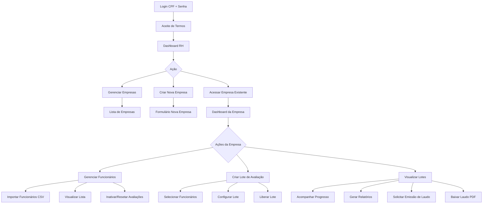
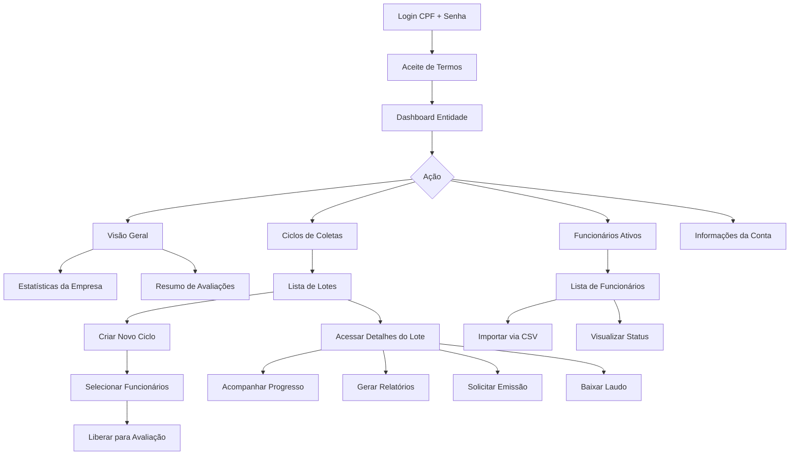
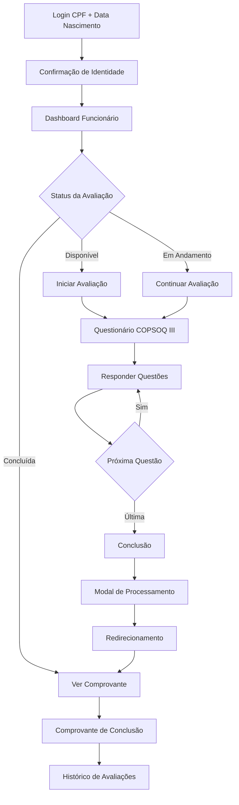
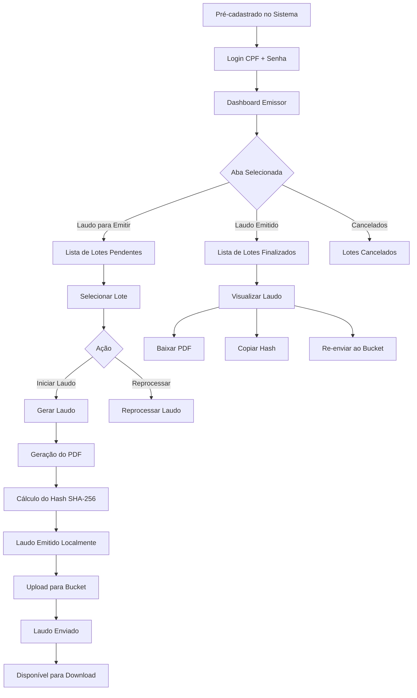

# 📚 Plano de Manuais por Tipo de Usuário

**Data:** 18/02/2026  
**Objetivo:** Criar manuais específicos para cada tipo de usuário do sistema QWork, considerando a jornada completa de cada perfil.

---

## 🎯 Visão Geral dos Perfis

| Perfil              | Descrição                             | Acesso                     | Autenticação          |
| ------------------- | ------------------------------------- | -------------------------- | --------------------- |
| **Gestor RH**       | Gerencia clínicas e empresas clientes | `/rh/*`                    | CPF + Senha           |
| **Gestor Entidade** | Gerencia a própria empresa (tomador)  | `/entidade/*`              | CPF + Senha           |
| **Funcionário**     | Responde avaliações psicossociais     | `/dashboard`, `/avaliacao` | CPF + Data Nascimento |
| **Emissor**         | Emite laudos (pré-cadastrado)         | `/emissor/*`               | CPF + Senha           |

---

## 📖 Manual 1: Gestor RH

### Jornada Completa

### Seções do Manual

1. **Acesso ao Sistema**
   - Como fazer login
   - Aceite de termos de uso
   - Recuperação de acesso

2. **Gestão de Empresas Clientes**
   - Cadastrar nova empresa
   - Editar dados da empresa
   - Visualizar estatísticas

3. **Gestão de Funcionários**
   - Importar funcionários via CSV
   - Visualizar lista de funcionários
   - Inativar funcionários
   - Resetar avaliações

4. **Ciclos de Coletas Avaliativas**
   - Criar novo ciclo/lote
   - Selecionar funcionários
   - Liberar lote para avaliação
   - Acompanhar progresso

5. **Emissão de Laudos**
   - Quando solicitar emissão
   - Fluxo de pagamento
   - Download do laudo
   - Verificação de integridade (hash)

6. **Relatórios**
   - Gerar relatório do lote
   - Gerar relatório individual
   - Exportar dados

---

## 📖 Manual 2: Gestor Entidade

### Jornada Completa

### Seções do Manual

1. **Acesso ao Sistema**
   - Login e segurança
   - Termos de uso

2. **Visão Geral**
   - Dashboard da empresa
   - Métricas principais

3. **Gestão de Funcionários**
   - Importar funcionários
   - Visualizar funcionários ativos
   - Status das avaliações

4. **Ciclos de Coletas Avaliativas**
   - Criar novo ciclo
   - Selecionar participantes
   - Liberar avaliações
   - Acompanhar andamento

5. **Detalhes do Lote**
   - Visualizar funcionários do lote
   - Progresso individual
   - Classificações de risco (G1-G10)
   - Inativar/Resetar avaliações

6. **Emissão de Laudos**
   - Solicitar emissão
   - Acompanhar status
   - Download e verificação

---

## 📖 Manual 3: Funcionário

### Jornada Completa

### Seções do Manual

1. **Primeiro Acesso**
   - Como fazer login (CPF + data de nascimento)
   - Confirmação de identidade
   - Dicas de segurança

2. **Dashboard**
   - Visualizar avaliações disponíveis
   - Histórico de avaliações
   - Status atual

3. **Realizando a Avaliação**
   - Iniciando a avaliação
   - Escala de respostas (0-4)
   - Salvamento automático
   - Pausar e continuar depois
   - Tempo estimado (15-20 minutos)

4. **Conclusão**
   - Tela de confirmação
   - Comprovante de conclusão
   - O que acontece após concluir

5. **Dúvidas Frequentes**
   - Posso refazer a avaliação?
   - Minhas respostas são confidenciais?
   - Como funciona a classificação de risco?

---

## 📖 Manual 4: Emissor

### Jornada Completa

### Seções do Manual

1. **Acesso ao Sistema**
   - Login como emissor
   - Pré-cadastro (como funciona)
   - Instalar aplicativo PWA

2. **Dashboard do Emissor**
   - Aba "Laudo para Emitir"
   - Aba "Laudo Emitido"
   - Aba "Cancelados"
   - Atualização automática (polling)

3. **Emissão de Laudos**
   - Visualizar lote recebido
   - Iniciar geração do laudo
   - Pré-visualização
   - Confirmar emissão
   - Reprocessar (se necessário)

4. **Upload para Bucket**
   - Quando fazer upload
   - Status do upload
   - Verificar URL remota

5. **Integridade e Segurança**
   - Hash SHA-256
   - Verificação de autenticidade
   - Boas práticas

6. **Histórico e Rastreamento**
   - Visualizar laudos emitidos
   - Dados do emissor
   - Timestamps de emissão

---

## 📋 Estrutura Comum dos Manuais

Cada manual deve conter:

1. **Capa**
   - Título do manual
   - Versão do sistema
   - Data de atualização

2. **Sumário**
   - Navegação rápida

3. **Introdução**
   - Sobre o sistema QWork
   - Sobre o COPSOQ III
   - Objetivo do manual

4. **Conteúdo Principal**
   - Seções específicas por perfil

5. **FAQ**
   - Perguntas frequentes

6. **Suporte**
   - Contatos
   - Canais de ajuda

---

## 🎨 Formato de Entrega

- **Arquivos:** Markdown (.md) no diretório `/docs/manuais/`
- **Diagramas:** Mermaid embutido nos arquivos
- **Imagens:** Screenshots quando necessário (diretório `/docs/manuais/images/`)
- **PDF:** Gerado a partir do Markdown para distribuição

---

## 📅 Próximos Passos

1. [ ] Criar diretório `/docs/manuais/`
2. [ ] Escrever Manual do Gestor RH
3. [ ] Escrever Manual do Gestor Entidade
4. [ ] Escrever Manual do Funcionário
5. [ ] Escrever Manual do Emissor
6. [ ] Revisar com o usuário
7. [ ] Gerar versões PDF

---

**Aprovação necessária para prosseguir com a escrita dos manuais.**
